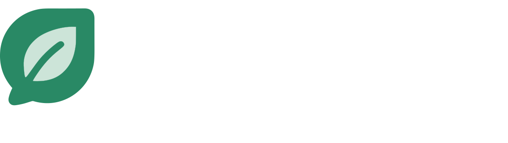

  

<h1 align="center">AutoClaw</h1>

  <strong>Automated OpenClaw Deployment in Minutes</strong> 

  
  
  
  

  
  
  

---

## 🦞 What is AutoClaw?

AutoClaw is a managed deployment platform for [OpenClaw](https://github.com/nicholascross/openclaw) — a powerful personal AI assistant. Skip the DevOps headaches and get straight to using your AI agent.

**No SSH. No server setup. No networking hassles.** We handle everything.

## ✨ Features

### 🚀 One-Click Deploy
Deploy OpenClaw with a single click. We provision servers, install dependencies, and configure Tailscale networking automatically.

### 📊 Unified Cost Dashboard
Track API usage across all providers (Anthropic, OpenAI, etc.) in one centralized dashboard. Know exactly what you're spending.

### 💬 20+ Communication Channels
Chat with your agent from anywhere:
- **Ready to go:** WebChat
- **Setup required:** WhatsApp, Telegram, Discord, Slack, Signal, iMessage, Google Chat, MS Teams, Matrix, and more

### 🛠️ 50+ Curated Skills
All skills are vetted for security — no unverified community code:
- **Development:** GitHub, Coding Agent
- **Communication:** Gmail, Calendar
- **Productivity:** Notes, Reminders
- **Utility:** Browser, Weather
- **Smart Home:** Spotify, Sonos, Hue lights, 1Password, Trello, and more

### 🎙️ Voice & Multi-Platform
- Voice Wake, Talk Mode, and Text-to-Speech
- macOS app, iOS node, Android node
- Browser control with screenshots and automation

### 🔄 Managed Updates & Support
We keep your OpenClaw instance up to date with zero-surprise upgrades and provide direct support when you need it.

## 🔗 Links

| Resource | Link |
|----------|------|
| 🌐 Website | [autoclaw.dev](https://autoclaw.dev) |
| 📖 Documentation | [autoclaw.dev/docs](https://autoclaw.dev/docs) |

  <em>AutoClaw is an independent open source project built to simplify the deployment and operation of OpenClaw. A portion of any profits will be reinvested into the OpenClaw ecosystem.</em>

  Made with 🦞 by the AutoClaw team

