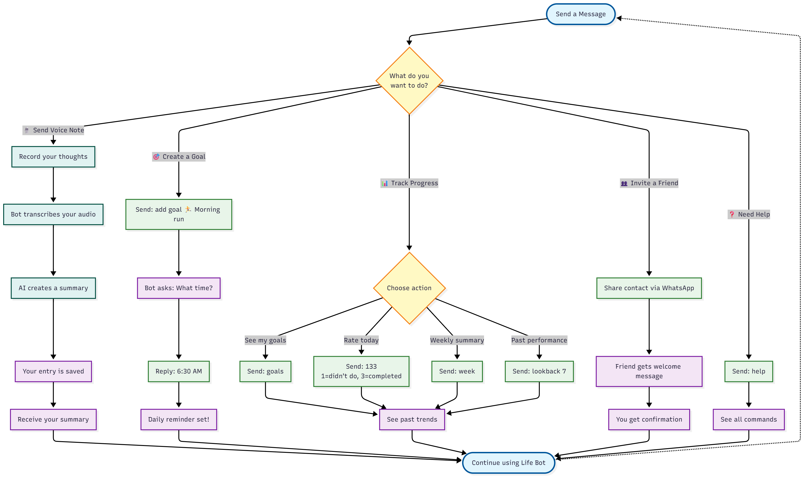
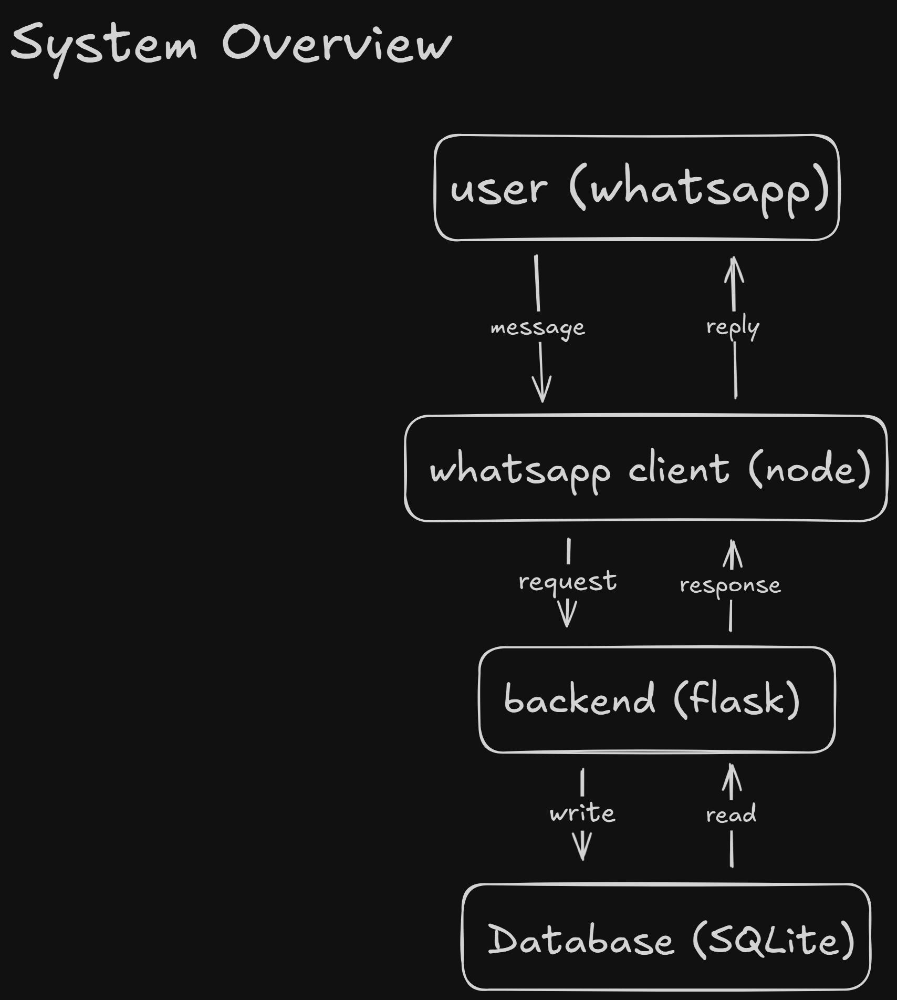

<div align="center">
  

  # LogLife

  **Track your days. Reflect. Grow.**

  <p align="center">
    
    
    
  </p>
</div>

---

## 🌿 About LogLife

**LogLife** is an audio-first, chat-native tool for people who need a frictionless way to journal and think about their lives. Living inside your favorite chat app, LogLife helps you capture daily notes, see behavior patterns, and turn those insights into steady progress.


It combines a minimalist interface with powerful backend processing to help you:
*   **Capture** thoughts instantly via voice notes.
*   **Reflect** on your day with clear summaries.
*   **Grow** by tracking your goals without the guilt.

---

## ✨ Features

*   **🎙️ Audio-First Journaling:** Just talk. Send voice notes to capture thoughts instantly. We handle the transcription and summarization so you can focus on the moment.
*   **💬 Chat-Native:** Works in your favorite chat app (**WhatsApp** today; **Telegram** and **iMessage** soon).
*   **📈 Gentle Goal Tracking:** A minimalist system to rate your days and track habits. No streaks to break, just data to learn from.
*   **🌱 Pattern Recognition:** Turn scattered thoughts into progress. Our AI spots patterns in your logs to help you reflect and grow.
*   **🔔 Calm Nudges:** Smart, low-stress reminders that encourage consistency rather than demanding attention.
*   **🤝 Frictionless Sharing:** Invite others to the journey simply by sharing a contact card.
*   **🔒 Private by Design:** Your reflections are personal. Secure & encrypted from the ground up.
*   **🧘‍♂️ Quiet Technology:** A tool that is calm, trustworthy, and encouraging, not flashy. 
---

## 🚀 How It Works

LogLife operates as a friendly bot in your WhatsApp. Here is the typical user flow:

<div align="center">
  
</div>

1.  **Chat:** You interact with the bot via text or audio.
2.  **Process:** The system processes your input (transcribing audio, updating database).
3.  **Respond:** LogLife replies with confirmations, summaries, or next steps.

---

## 🏗️ System Architecture

LogLife is built with a microservices architecture to ensure scalability and separation of concerns:

<div align="center">
  
</div>

*   **Backend:** Python (Flask) handling business logic, database operations (SQLite), and AI integration.
*   **WhatsApp Client:** Node.js service using `whatsapp-web.js` to interface with the WhatsApp network.
*   **AI Services:** Integration with **AssemblyAI** (transcription) and **OpenAI** (summarization).

---

## 🛠️ Tech Stack

*   **Backend:** Python 3.11+, Flask, SQLite
*   **Client:** Node.js, whatsapp-web.js, Express
*   **AI:** OpenAI GPT-4 (or similar), AssemblyAI
*   **Tools:** `uv` (Python package manager), `pytest`, `ruff`

---

## 🏁 Getting Started

Follow these steps to set up LogLife on your local machine.

### Prerequisites

*   Python 3.11 or higher
*   Node.js 16 or higher
*   A WhatsApp account (to act as the bot)
*   API Keys for OpenAI and AssemblyAI

### Installation

1.  **Clone the repository:**
    ```bash
    git clone https://github.com/jmoraispk/life-bot.git
    cd loglife
    ```

2.  **Set up the Backend:**
    ```bash
    # Install dependencies and run the backend
    uv run backend/main.py
    ```

3.  **Set up the WhatsApp Client:**
    Open a new terminal window:
    ```bash
    cd whatsapp-client
    npm install
    node index.js
    ```

4.  **Connect WhatsApp:**
    *   The Node.js client will generate a QR code in the terminal.
    *   Open WhatsApp on your phone (Linked Devices) and scan the QR code.

### 🧪 Running Tests

To ensure everything is working correctly, run the backend tests:

```bash
uv run pytest backend/tests
```

---

## 📚 Documentation

For more detailed information, check out the full documentation in the `docs/` folder:

*   **[Usage Guide](docs/usage/overview.md):** Learn how to use audio journaling and goal tracking.
*   **[Developer Guide](docs/developer/overview.md):** Deep dive into the backend and client setup.
*   **[API Reference](docs/api/overview.md):** Explore the internal API endpoints.

---

<div align="center">
  <sub>Built with 💚 for people who want to live better.</sub>
</div>
