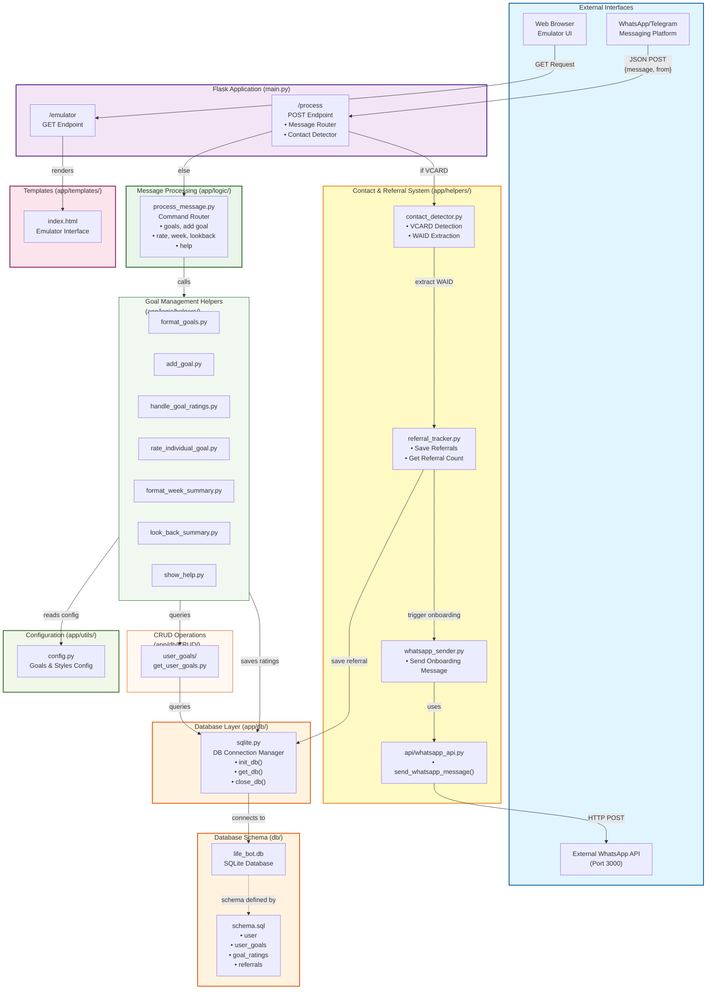

# Backend Code Architecture

## Overview
This diagram shows the complete backend architecture for the Life Bot application, including the recent additions of **Contact Sharing** and **Referral Tracking** features.

## Key Features

### 1. Contact Sharing & Referral System (NEW)
- **VCARD Detection**: Automatically detects when users share contacts via WhatsApp
- **WAID Extraction**: Extracts WhatsApp ID from contact data
- **Referral Tracking**: Saves referral relationships in database
- **Auto-Onboarding**: Automatically sends welcome message to referred contacts

### 2. Goal Management
- Track personal goals with emojis and descriptions
- Rate goals individually or in bulk (1-3 scale)
- View weekly summaries and lookback reports

### 3. Database Schema
- `user`: User information
- `user_goals`: Goal definitions
- `goal_ratings`: Daily goal ratings
- `referrals`: Referral tracking (NEW)

## Architecture Flow

### Contact Sharing Flow (NEW)
1. User shares contact via WhatsApp → VCARD format received
2. `/process` endpoint detects VCARD format
3. Extracts WAID (WhatsApp ID) from contact data
4. Saves referral to database (referrer → referred)
5. Sends onboarding message to referred contact via WhatsApp API
6. Returns confirmation message to referrer

### Regular Message Flow
1. User sends text message → `/process` endpoint
2. Routes to `process_message.py` command parser
3. Executes appropriate helper function (goals, rate, week, etc.)
4. Queries database via CRUD operations
5. Returns formatted response

## Diagram

## Component Details

### Contact & Referral System (Yellow Box - NEW)
| Component | Description | Key Functions |
|-----------|-------------|---------------|
| `contact_detector.py` | Detects VCARD format and extracts WhatsApp IDs | `is_contact_shared()`, `extract_waid_from_contact()` |
| `referral_tracker.py` | Manages referral database operations | `save_referral()`, `get_referral_count()` |
| `whatsapp_sender.py` | Sends onboarding messages to new referrals | `send_hi_message_to_contact()` |
| `api/whatsapp_api.py` | External WhatsApp API client | `send_whatsapp_message()` |

### Flask Application (Purple Box)
| Endpoint | Method | Description |
|----------|--------|-------------|
| `/emulator` | GET | Serves web-based emulator interface |
| `/process` | POST | Main webhook endpoint for message processing and contact detection |

### Message Processing (Green Box)
| Component | Description |
|-----------|-------------|
| `process_message.py` | Routes commands to appropriate handlers (goals, rate, week, lookback, help, add goal) |

### Goal Management Helpers (Light Green Box)
| Component | Purpose |
|-----------|---------|
| `format_goals.py` | Display user's goals in formatted list |
| `add_goal.py` | Add new goals with emoji and description |
| `handle_goal_ratings.py` | Process bulk goal ratings (e.g., "123") |
| `rate_individual_goal.py` | Rate single goal (e.g., "rate 2 3") |
| `format_week_summary.py` | Generate weekly goal summary |
| `look_back_summary.py` | Show historical goal performance |
| `show_help.py` | Display help message with commands |

### Database Layer (Orange Box)
| Component | Description |
|-----------|-------------|
| `sqlite.py` | Database connection manager with init, get, and close functions |
| CRUD Operations | User goals queries and operations |

### Database Schema
| Table | Description | New? |
|-------|-------------|------|
| `user` | User information (id, name, phone) | No |
| `user_goals` | Goal definitions with emoji and description | No |
| `goal_ratings` | Daily goal ratings (1-3 scale) | No |
| `referrals` | Referral tracking (referrer → referred) | **✓ Yes** |

## Technology Stack
- **Backend Framework**: Flask (Python)
- **Database**: SQLite
- **External API**: WhatsApp API (Node.js service on port 3000)
- **Message Format**: VCARD for contact sharing
- **Deployment**: Python with dotenv for configuration

