# Backend Code Architecture

## Overview
This diagram shows the complete backend architecture for the Life Bot application, including **Audio Journaling**, **Contact Sharing**, **Referral Tracking**, and **Goal Reminders** features.

**Recent Additions:**
- **Audio Journaling Feature**: Complete audio message processing pipeline with transcription and AI summarization
- Route modularization: Endpoints moved to Blueprint modules (`app/routes/web.py`, `app/routes/webhook.py`)
- Audio message routing: WhatsApp client detects and downloads audio, backend processes via AssemblyAI and OpenAI
- VCARD processing moved: Logic migrated from `webhook.py` to `process_message.py` for cleaner separation of concerns
- Data access module structure: Added `__init__.py` files for unified import interface (`app/db/data_access/`)
- Function naming improvements (VCARD-related functions)
- Message centralization in `app/utils/messages.py`
- Type hints modernization (dict/list instead of Dict/List)
- Directory rename: CRUD → data_access

## Key Features

### 1. Audio Journaling System (NEW)
- **Audio Message Processing**: Users can send audio messages for journaling
- **Speech-to-Text**: Automatic transcription using AssemblyAI API
- **AI Summarization**: Transcript summarization using OpenAI GPT models
- **Real-time Status Updates**: Users receive status messages during processing (receiving, transcribing, summarizing)
- **Persistent Storage**: Both transcripts and summaries stored in database
- **Error Handling**: Graceful error handling with user-friendly messages

### 2. Goal Reminders System
- **Daily Reminders**: Users can set reminder times when adding goals
- **Timezone Support**: Automatic timezone detection from phone numbers
- **Flexible Time Input**: Supports multiple formats (18:00, 6 PM, 6pm, etc.)
- **Background Service**: Efficient thread-based service sends WhatsApp reminders
- **State Management**: Multi-step conversation flow for reminder setup

### 3. Contact Sharing & Referral System
- **VCARD Detection**: Automatically detects when users share contacts via WhatsApp
- **WAID Extraction**: Extracts WhatsApp ID from contact data
- **Referral Tracking**: Saves referral relationships in database
- **Auto-Onboarding**: Automatically sends welcome message to referred contacts

### 4. Goal Management
- Track personal goals with emojis and descriptions
- **Boost levels**: Each goal has a boost level (default: 1) displayed when listing goals
- Rate goals individually or in bulk (1-3 scale)
- View weekly summaries and lookback reports

### 5. Database Schema
- `user`: User information with timezone
- `user_goals`: Goal definitions with reminder times and boost levels
- `goal_ratings`: Daily goal ratings
- `referrals`: Referral tracking
- `user_states`: Conversation state tracking
- `audio_journal_entries`: Audio journal transcripts and summaries

## Architecture Flow

### Reminder System Flow (NEW)
1. **Goal Addition with Reminder**:
   - User sends "add goal 🏃 Morning run"
   - `add_goal.py` creates goal in database (reminder_time = NULL initially)
   - Detects/saves user timezone from phone number
   - Sets user state to 'waiting_for_reminder_time'
   - Prompts user for reminder time
   
2. **Reminder Time Setup**:
   - User sends time (e.g., "6 PM", "18:00", "6pm")
   - `process_message.py` detects user state
   - `time_parser.py` parses time to HH:MM format (24-hour)
   - `add_goal.py` updates goal with reminder_time
   - Clears user state

3. **Background Reminder Service**:
   - Started by `main.py` on application startup
   - Runs in daemon thread
   - Calculates next reminder time efficiently (sleeps until due)
   - Queries database for due reminders (timezone-aware)
   - Sends WhatsApp message via `whatsapp_api.py`
   - Caches sent reminders to avoid duplicates

### Audio Journaling Flow (NEW)
1. **Audio Reception**:
   - User sends audio message (voice note/audio file) via WhatsApp
   - WhatsApp client detects audio message type ('ptt' or 'audio')
   - Client downloads media and extracts audio data (base64 encoded)
   - Sends payload with messageType, audio data, mimetype to backend

2. **Audio Processing**:
   - `webhook.py` `/process` endpoint receives audio payload
   - Detects messageType is 'ptt' or 'audio' with audio data
   - Routes to `process_audio.py` for processing
   - Sends status message: "Audio received. Transcribing..."

3. **Transcription**:
   - `process_audio.py` calls `transcribe_audio.py`
   - Decodes base64 audio data
   - Uploads audio to AssemblyAI via `/v2/upload` endpoint
   - Submits transcription job via `/v2/transcript` endpoint
   - Polls transcription status until completion
   - Returns transcript text

4. **Summarization**:
   - Sends status message: "Audio transcribed. Summarizing..."
   - `process_audio.py` calls `summarize_transcript.py`
   - Sends transcript to OpenAI API (gpt-5-nano model)
   - Receives summary text from AI

5. **Storage & Response**:
   - Saves transcript and summary to `audio_journal_entries` table
   - Sends status message: "Summary stored in Database."
   - Returns final summary to user via WhatsApp

### Contact Sharing Flow
1. User shares contact via WhatsApp → VCARD format received
2. `webhook.py` `/process` endpoint receives message
3. `process_message.py` detects VCARD format
4. Extracts WAID (WhatsApp ID) from contact data
5. Saves referral to database (referrer → referred)
6. Sends onboarding message to referred contact via WhatsApp API
7. Returns confirmation message to referrer

### Regular Message Flow
1. User sends text message → `webhook.py` `/process` endpoint
2. Routes to `process_message.py` command parser
3. Checks user state (for multi-step interactions like reminder setup)
4. Executes appropriate helper function (goals, rate, week, etc.)
5. Queries database via data access operations
6. Returns formatted response

## Diagram

```mermaid
graph TB
    subgraph external["External Interfaces"]
        whatsapp["WhatsApp/Telegram<br/>Messaging Platform"]
        browser["Web Browser<br/>Emulator UI"]
        whatsapp_api_ext["External WhatsApp API<br/>(Port 3000)"]
    end

    subgraph flask["Flask Application"]
        main["main.py<br/>Application Entry Point<br/>• Blueprint Registration<br/>• DB Initialization<br/>• Start Reminder Service"]
        
        subgraph routes["Route Modules (app/routes/)"]
            web_routes["web.py<br/>/emulator<br/>GET Endpoint"]
            webhook_routes["webhook.py<br/>/process<br/>POST Endpoint<br/>• Clean Request Handler"]
        end
    end

    subgraph reminder_system["Reminder System (app/helpers/) - NEW"]
        reminder_service["reminder_service.py<br/>• Background Thread<br/>• Calculate Next Reminder<br/>• Send Daily Reminders"]
        state_manager["state_manager.py<br/>• Set/Get User State<br/>• Track Multi-step Flows"]
        time_parser["time_parser.py<br/>• Parse Time Input<br/>• Format Time Display"]
        timezone_helper["timezone_helper.py<br/>• Detect Timezone from Phone"]
        user_timezone["user_timezone.py<br/>• Save User Timezone<br/>• Update Existing Users"]
    end

    subgraph audio_journal["Audio Journaling System (app/logic/) - NEW"]
        process_audio["process_audio.py<br/>• Audio Processing Workflow<br/>• Status Messaging<br/>• Error Handling"]
        transcribe_audio["helpers/transcribe_audio.py<br/>• Upload to AssemblyAI<br/>• Poll Transcription<br/>• Return Transcript"]
        summarize_transcript["helpers/summarize_transcript.py<br/>• OpenAI API Call<br/>• Generate Summary"]
        audio_journal_data["data_access/audio_journal.py<br/>• create_audio_journal_entry()"]
        api_config["utils/api_config.py<br/>• AssemblyAI Config<br/>• API Headers"]
    end

    subgraph contact_referral["Contact & Referral System (app/helpers/)"]
        contact_detector["contact_detector.py<br/>• VCARD Detection<br/>• WAID Extraction"]
        referral_tracker["referral_tracker.py<br/>• Save Referrals<br/>• Get Referral Count"]
        whatsapp_sender["whatsapp_sender.py<br/>• Send Onboarding Message"]
        whatsapp_api["api/whatsapp_api.py<br/>• send_whatsapp_message()"]
    end

    subgraph logic["Message Processing (app/logic/)"]
        process_msg["process_message.py<br/>Command Router<br/>• VCARD Detection & Processing<br/>• User State Checking<br/>• goals, add goal<br/>• rate, week, lookback<br/>• help"]
    end

    subgraph helpers["Goal Management Helpers<br/>(app/logic/helpers/)"]
        format_goals["format_goals.py"]
        add_goal["add_goal.py<br/>• Add Goal<br/>• Set Reminder Time<br/>• Timezone Detection"]
        handle_ratings["handle_goal_ratings.py"]
        rate_goal["rate_individual_goal.py"]
        week_summary["format_week_summary.py"]
        lookback["look_back_summary.py"]
        show_help["show_help.py"]
    end

    subgraph db_layer["Database Layer (app/db/)"]
        sqlite["sqlite.py<br/>DB Connection Manager<br/>• init_db()<br/>• get_db()<br/>• close_db()"]
    end

    subgraph crud["Data Access<br/>(app/db/data_access/)"]
        data_access_init["__init__.py<br/>Unified Interface<br/>• get_user_goals<br/>• create_audio_journal_entry"]
        get_goals["user_goals/<br/>__init__.py<br/>get_user_goals.py"]
        audio_data_access["audio_journal.py<br/>Audio Journal DB Ops"]
    end

    subgraph schema["Database Schema (db/)"]
        schema_sql["schema.sql<br/>• user (+ timezone)<br/>• user_goals (+ reminder_time)<br/>• goal_ratings<br/>• referrals<br/>• user_states<br/>• audio_journal_entries"]
        life_bot_db["life_bot.db<br/>SQLite Database"]
    end

    subgraph templates["Templates (app/templates/)"]
        index["index.html<br/>Emulator Interface"]
    end

    subgraph utils["Utilities (app/utils/)"]
        config_py["config.py<br/>Goals & Styles Config"]
        messages_py["messages.py<br/>User-facing Messages<br/>& Text Constants"]
    end

    %% External connections
    browser -->|"GET Request"| web_routes
    whatsapp -->|"JSON POST<br/>{message, from, messageType, audio}"| webhook_routes
    
    %% Flask routing
    main -->|"registers"| routes
    main -->|"starts at app init"| reminder_service
    web_routes -->|"renders"| index
    
    %% Process endpoint flow
    webhook_routes -->|"routes text"| process_msg
    webhook_routes -->|"routes audio"| process_audio
    
    %% Audio journaling flow
    process_audio -->|"decodes & uploads"| transcribe_audio
    transcribe_audio -->|"uses config"| api_config
    process_audio -->|"summarizes"| summarize_transcript
    process_audio -->|"sends status"| whatsapp_api
    process_audio -->|"saves entry"| audio_journal_data
    audio_journal_data -->|"writes to"| sqlite
    
    %% Reminder system flow
    reminder_service -->|"queries goals<br/>with reminder_time"| sqlite
    reminder_service -->|"sends reminder"| whatsapp_api
    process_msg -->|"checks state"| state_manager
    add_goal -->|"sets state"| state_manager
    add_goal -->|"parses time"| time_parser
    add_goal -->|"detects timezone"| user_timezone
    user_timezone -->|"uses"| timezone_helper
    add_goal -->|"saves goal & time"| sqlite
    
    %% Contact/Referral flow
    process_msg -->|"if VCARD"| contact_detector
    contact_detector -->|"extract WAID"| referral_tracker
    referral_tracker -->|"save referral"| sqlite
    referral_tracker -->|"trigger onboarding"| whatsapp_sender
    whatsapp_sender -->|"uses"| whatsapp_api
    whatsapp_api -->|"HTTP POST"| whatsapp_api_ext
    
    %% Message processing flow
    process_msg -->|"calls"| helpers
    
    %% Goal helpers flow
    helpers -->|"queries"| data_access_init
    data_access_init -->|"imports from"| get_goals
    data_access_init -->|"imports from"| audio_data_access
    helpers -->|"reads config"| config_py
    helpers -->|"uses messages"| messages_py
    webhook_routes -->|"uses messages"| messages_py
    
    %% Database flow
    get_goals -->|"queries"| sqlite
    audio_data_access -->|"queries"| sqlite
    helpers -->|"saves ratings"| sqlite
    sqlite -->|"connects to"| life_bot_db
    life_bot_db -.->|"schema defined by"| schema_sql

    %% Styling
    style external fill:#e1f5fe,stroke:#01579b,stroke-width:2px
    style flask fill:#f3e5f5,stroke:#4a148c,stroke-width:2px
    style reminder_system fill:#e1bee7,stroke:#6a1b9a,stroke-width:2px
    style audio_journal fill:#e0f2f1,stroke:#004d40,stroke-width:2px
    style contact_referral fill:#fff9c4,stroke:#f57f17,stroke-width:2px
    style logic fill:#e8f5e8,stroke:#1b5e20,stroke-width:2px
    style helpers fill:#f0f8f0,stroke:#1b5e20,stroke-width:1px
    style db_layer fill:#fff3e0,stroke:#e65100,stroke-width:2px
    style crud fill:#fff8f0,stroke:#e65100,stroke-width:1px
    style schema fill:#fff3e0,stroke:#e65100,stroke-width:2px
    style templates fill:#fce4ec,stroke:#880e4f,stroke-width:2px
    style utils fill:#f1f8e9,stroke:#33691e,stroke-width:2px
```

## Component Details

### Audio Journaling System (Teal Box - NEW)
| Component | Description | Key Functions |
|-----------|-------------|---------------|
| `process_audio.py` | Main audio processing orchestrator that handles the entire workflow | `process_audio()` - coordinates transcription, summarization, storage, and user notifications |
| `helpers/transcribe_audio.py` | Handles audio transcription using AssemblyAI API | `transcribe_audio()` - uploads audio, creates transcription job, polls for completion |
| `helpers/summarize_transcript.py` | Summarizes transcripts using OpenAI API | `summarize_transcript()` - sends transcript to GPT model, returns summary |
| `data_access/audio_journal.py` | Database operations for audio journal entries | `create_audio_journal_entry()` - saves transcript and summary to database |
| `utils/api_config.py` | Centralizes external API configuration | `ASSEMBLYAI_BASE_URL`, `ASSEMBLYAI_HEADERS` |

### Reminder System (Purple Box)
| Component | Description | Key Functions |
|-----------|-------------|---------------|
| `reminder_service.py` | Background thread service for sending reminders | `start_reminder_service()`, `reminder_worker()`, `check_and_send_reminders()`, `calculate_next_reminder_seconds()` |
| `state_manager.py` | Manages user conversation states for multi-step interactions | `set_user_state()`, `get_user_state()`, `clear_user_state()` |
| `time_parser.py` | Parses various time formats and formats time for display | `parse_reminder_time()`, `format_time_for_display()` |
| `timezone_helper.py` | Detects timezone from phone numbers using phonenumbers library | `get_timezone_from_number()` |
| `user_timezone.py` | Manages user timezone in database | `detect_user_timezone()`, `save_user_timezone()`, `update_existing_user_timezone()` |

### Contact & Referral System (Yellow Box)
| Component | Description | Key Functions |
|-----------|-------------|---------------|
| `contact_detector.py` | Detects VCARD format and extracts WhatsApp IDs | `is_vcard()`, `extract_waid_from_vcard()` |
| `referral_tracker.py` | Manages referral database operations and workflow | `process_referral()`, `save_referral()`, `get_referral_count()` |
| `whatsapp_sender.py` | Sends onboarding messages to new referrals | `send_onboarding_msg()` |
| `api/whatsapp_api.py` | External WhatsApp API client | `send_whatsapp_message()` |

### Flask Application (Purple Box)
| Component | Description |
|-----------|-------------|
| `main.py` | Application entry point that initializes the Flask app, registers blueprints (web_bp, webhook_bp), initializes database, and **starts reminder service thread** |
| `app/routes/web.py` | Web routes blueprint containing `/emulator` GET endpoint for the emulator interface |
| `app/routes/webhook.py` | Webhook routes blueprint containing `/process` POST endpoint - routes text messages to `process_message.py` and **audio messages (messageType: 'ptt'/'audio') to `process_audio.py`** |

### Message Processing (Green Box)
| Component | Description |
|-----------|-------------|
| `process_message.py` | Main message processor that detects VCARD contacts, **checks user conversation state**, and routes commands to appropriate handlers (goals, rate, week, lookback, help, add goal). Handles reminder time input when user is in 'waiting_for_reminder_time' state |

### Goal Management Helpers (Light Green Box)
| Component | Purpose |
|-----------|---------|
| `format_goals.py` | Display user's goals in formatted list with boost levels |
| `add_goal.py` | Add new goals with emoji and description. Sets default boost level. **Sets up reminder time**: detects user timezone, prompts for reminder time, parses time input, and saves to database |
| `handle_goal_ratings.py` | Process bulk goal ratings (e.g., "123") |
| `rate_individual_goal.py` | Rate single goal (e.g., "rate 2 3") |
| `format_week_summary.py` | Generate weekly goal summary |
| `look_back_summary.py` | Show historical goal performance |
| `show_help.py` | Display help message with commands |

### Database Layer (Orange Box)
| Component | Description |
|-----------|-------------|
| `sqlite.py` | Database connection manager with init, get, and close functions |
| Data Access | Unified module interface with `__init__.py` files for clean imports. Contains user goals queries and operations organized by domain |

### Utilities (Light Green Box)
| Component | Description |
|-----------|-------------|
| `config.py` | Goals configuration and styling constants. Defines DEFAULT_BOOST_LEVEL for goal boosting feature |
| `messages.py` | **Centralized user-facing messages** (welcome, help, errors, success messages). Improves maintainability and simplifies future translation/localization. |

### Database Schema
| Table | Description | New/Updated? |
|-------|-------------|------|
| `user` | User information (id, name, phone, **timezone**) | **✓ Updated** |
| `user_goals` | Goal definitions with emoji, description, **reminder_time**, and **boost_level** (default: 1) | **✓ Updated** |
| `goal_ratings` | Daily goal ratings (1-3 scale) | No |
| `referrals` | Referral tracking (referrer → referred) | No |
| `user_states` | User conversation state tracking (user_phone, state, temp_data) | No |
| `audio_journal_entries` | **Audio journal entries (user_id, transcription_text, summary_text, created_at)** | **✓ New** |

## Technology Stack
- **Backend Framework**: Flask (Python)
- **Database**: SQLite
- **External APIs**: 
  - WhatsApp API (Node.js service on port 3000)
  - **AssemblyAI API** (audio transcription)
  - **OpenAI API** (text summarization - GPT-5-nano model)
- **Message Format**: VCARD for contact sharing
- **Audio Processing**: Base64 encoding/decoding for audio data transfer
- **Background Services**: Threading for reminder service (daemon thread)
- **Timezone Support**: `zoneinfo` and `phonenumbers` libraries for timezone detection
- **Time Parsing**: Regex-based flexible time input parsing
- **Deployment**: Python with dotenv for configuration

