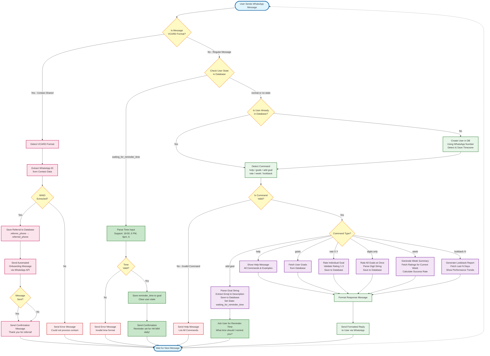

# User Flow Diagram

## Overview
This diagram illustrates the complete user interaction flow for the Life Bot application, including **regular message processing**, **contact sharing/referral system**, and the **reminder system with state management**.

## Key Updates
- ✅ Added contact sharing detection (VCARD format)
- ✅ Added referral tracking flow
- ✅ Added automated onboarding message flow
- ✅ **NEW: Added reminder system with multi-step conversation flow**
- ✅ **NEW: Added state management for waiting for reminder time**
- ✅ **NEW: Added flexible time parsing (18:00, 6 PM, 6pm, etc.)**
- ✅ Updated command list to reflect current features

## User Journey

### Regular Message Flow
1. User sends text command via WhatsApp
2. System checks user state (NEW - for multi-step flows)
3. System checks if user exists (creates if new)
4. Detects and validates command
5. Executes command logic against database
6. Returns formatted response

### Contact Sharing Flow
1. User shares a contact via WhatsApp
2. System detects VCARD format
3. Extracts WhatsApp ID (WAID) from contact data
4. Saves referral record to database
5. Sends automated onboarding message to referred contact
6. Returns confirmation to referrer

### Reminder Setup Flow (NEW)
1. User sends "add goal 😴 Sleep by 9pm"
2. System saves goal to database
3. System sets user state to "waiting_for_reminder_time"
4. System asks: "What time should I remind you?"
5. User responds with time (e.g., "18:00", "6 PM")
6. System parses and validates time
7. System saves reminder_time to goal
8. System clears user state
9. System confirms reminder is set
10. Background cron job sends daily reminders at scheduled time

## Diagram



## Flow Details

### 1. Entry Point
- **Start**: User sends any type of message via WhatsApp
- Message is delivered to Flask `/process` endpoint as JSON payload

### 2. Message Type Detection
- **VCARD Format Check**: Determines if message is contact sharing (VCARD format)
  - VCARD Format: `BEGIN:VCARD\n...TEL;type=CELL;waid=...END:VCARD`
  - Regular Message: Plain text command

### 3. State Management Check (NEW - Green Nodes)
- **Check User State**: Query `user_states` table to determine if user is in multi-step flow
  - **waiting_for_reminder_time**: User just added a goal, system is waiting for time input
  - **normal** or **no state**: Process as regular command
- This enables conversational, multi-step interactions

### 4. Reminder Time Input Flow (NEW - Green Nodes)
When user is in `waiting_for_reminder_time` state:
1. **Parse Time Input**: Use `time_parser.py` to parse flexible formats
   - Supported: `18:00`, `6 PM`, `6pm`, `6:00 PM`, `6`
   - Normalizes to HH:MM format (24-hour)
2. **Validate Time**: Check if parsing succeeded
   - Valid: Continue to save
   - Invalid: Send error message with format examples
3. **Save Reminder Time**: Update goal's `reminder_time` field in database
4. **Clear State**: Set user state back to 'normal'
5. **Confirm**: Send confirmation message with formatted time
6. **Background Job**: `reminder.py` cron will handle sending reminders daily

### 5. Contact Sharing Flow (Pink Nodes)
When VCARD is detected:
1. **Extract WAID**: Parse WhatsApp ID from VCARD data using regex pattern `waid=(\d+)`
2. **Save Referral**: Store referral record in database
   - Fields: `referrer_phone`, `referred_phone`, `referred_waid`, `status`
   - Duplicate check prevents multiple referrals
3. **Send Onboarding**: Automatically send welcome message to referred contact
   - Uses external WhatsApp API (port 3000)
   - Includes quick start guide and command examples
4. **Confirm**: Send thank you message to referrer
5. **Wait**: Return to listening state

### 6. Regular Message Flow (Green/Purple Nodes)

#### User Management
- **Check User**: Query database for existing user by phone number
- **Create User**: If new, insert user record with phone number and detect timezone

#### Command Detection & Validation
- **Detect Command**: Parse message text to identify command type
- **Validate Command**: Check if command matches known patterns
- **Invalid Command**: Send help message listing all available commands

#### Command Routing & Execution (Purple Nodes)
Each command type is routed to specific handler:

| Command | Handler | Database Operation | State Change |
|---------|---------|-------------------|--------------|
| `help` | `show_help.py` | None (static response) | None |
| `goals` | `format_goals.py` | SELECT user_goals | None |
| `add goal 😴 Description` | `add_goal.py` | INSERT INTO user_goals | **NEW: Sets state to 'waiting_for_reminder_time'** |
| `rate 2 3` | `rate_individual_goal.py` | INSERT INTO goal_ratings | None |
| `123` (digits) | `handle_goal_ratings.py` | INSERT INTO goal_ratings (bulk) | None |
| `week` | `format_week_summary.py` | SELECT goal_ratings (current week) | None |
| `lookback 7` | `look_back_summary.py` | SELECT goal_ratings (last N days) | None |

#### Response
- **Format Response**: Convert database results to user-friendly message
- **Send Response**: Deliver formatted message to user via WhatsApp
- **Wait**: Return to listening state

### 7. Error Handling
- **Invalid VCARD**: If WAID cannot be extracted, send error message
- **Invalid Command**: Send help message with command list
- **Invalid Time**: If time cannot be parsed, send error with format examples
- **API Failures**: Log error but confirm referral action to user

## Command Examples

### Regular Commands
```text
help                    → Show all commands
goals                   → List your goals
rate 1 3                → Rate goal #1 as success
123                     → Rate all goals (1=fail, 2=partial, 3=success)
week                    → Show current week summary
lookback 5              → Show last 5 days performance
```

### Add Goal with Reminder (NEW - Multi-Step Flow)
```text
User: add goal 🏃 Run daily
Bot: ✅ Goal added: 🏃 Run daily
     ⏰ What time should I remind you daily? (e.g., 18:00, 6 PM, 6pm)
     [System sets state: waiting_for_reminder_time]

User: 6 PM
     [System checks state, routes to time parser]
Bot: ✅ Reminder set for 6:00 PM daily!
     Your goal is now active with daily reminders.
     [System clears state, reminder active]
```

### Contact Sharing
```text
[User shares contact via WhatsApp]
→ Bot detects VCARD format
→ Extracts WAID and saves referral
→ Sends onboarding message to referred contact
→ Confirms action with referrer
```

## Database Interactions

### Tables Used
1. **user** - User registration with **timezone** (NEW field)
2. **user_goals** - Goal definitions with **reminder_time** (NEW field)
3. **goal_ratings** - Daily goal ratings
4. **referrals** - Referral tracking
5. **user_states** - Conversation state management (NEW table)

### CRUD Operations
- **CREATE**: New users, goals, ratings, referrals, user states
- **READ**: Fetch goals, ratings for summaries, user states for flow control
- **UPDATE**: Reminder times, user states
- **DELETE**: Soft delete for goals (is_active flag)

### State Management
- **user_states** table stores conversation state
  - Fields: `user_phone`, `state`, `temp_data`, `created_at`
  - Example states: `'normal'`, `'waiting_for_reminder_time'`
  - Enables multi-step conversational flows

## External Dependencies
- **WhatsApp Messaging Platform**: Message delivery
- **Flask Backend**: Command processing (port 5000)
- **SQLite Database**: Data persistence
- **WhatsApp API Service**: Automated message sending (port 3000)
- **Reminder Cron Job**: Background service for sending scheduled reminders (`uv run .\cron\reminder.py`)

## Key Decision Points
1. **VCARD Detection**: Enables referral vs. command processing
2. **State Check** (NEW): Determines if user is in multi-step flow or normal command mode
3. **User Existence**: Determines if user creation needed
4. **Command Validation**: Routes to appropriate handler or help message
5. **Command Type**: Routes to specific execution logic
6. **Time Validation** (NEW): Validates time format before saving reminder

## Notes
- All message processing is synchronous (no async/queue)
- Database operations use connection pooling via Flask teardown
- Referral system requires external WhatsApp API service
- **Reminder system requires background cron job running separately**
- **State management enables conversational, multi-step flows**
- **Timezone-aware reminders use user's detected timezone**
- VCARD format is specific to WhatsApp contact sharing
- Rating scale: 1 (fail), 2 (partial success), 3 (full success)
- **Supported time formats: 18:00, 6 PM, 6pm, 6:00 PM, 6**

