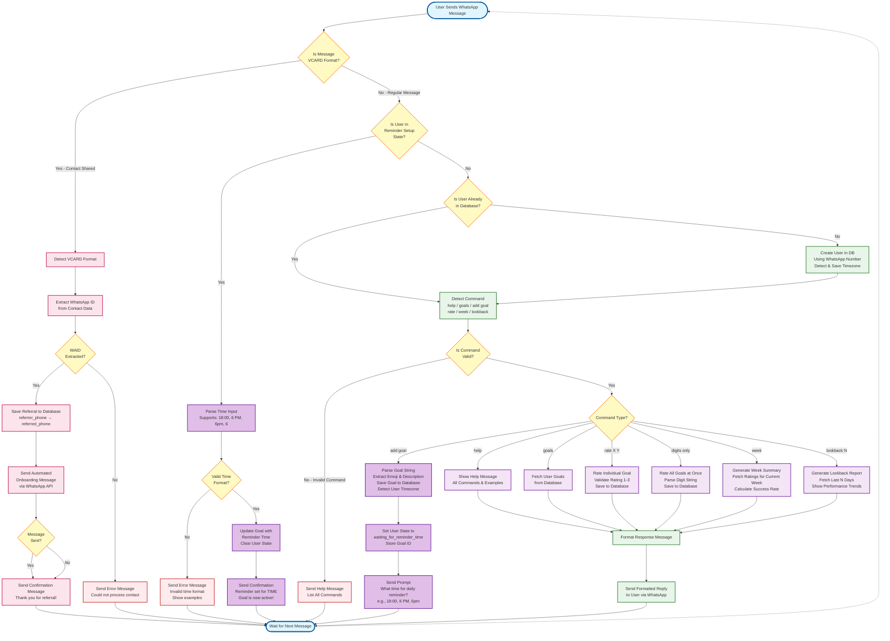

# User Flow Diagram

## Overview
This diagram illustrates the complete user interaction flow for the Life Bot application, including **regular message processing**, **contact sharing/referral system**, and the new **goal reminder setup flow**.

## Key Updates
- ✅ Added contact sharing detection (VCARD format)
- ✅ Added referral tracking flow
- ✅ Added automated onboarding message flow
- ✅ **Added multi-step goal reminder setup flow (NEW)**
- ✅ **Added conversation state management (NEW)**
- ✅ **Added timezone detection and time parsing (NEW)**
- ✅ Updated command list to reflect current features

## User Journey

### Regular Message Flow
1. User sends text command via WhatsApp
2. System checks if user exists (creates if new, detects timezone)
3. Checks user conversation state (for multi-step flows)
4. Detects and validates command
5. Executes command logic against database
6. Returns formatted response

### Goal Reminder Setup Flow (NEW)
1. User sends "add goal 🏃 Morning run"
2. System creates goal in database
3. Detects user timezone from phone number
4. Sets user state to 'waiting_for_reminder_time'
5. Prompts user for reminder time
6. User sends time (e.g., "6 PM", "18:00")
7. System parses time and updates goal
8. Clears user state
9. Background service sends daily reminders at specified time

### Contact Sharing Flow
1. User shares a contact via WhatsApp
2. System detects VCARD format
3. Extracts WhatsApp ID (WAID) from contact data
4. Saves referral record to database
5. Sends automated onboarding message to referred contact
6. Returns confirmation to referrer

## Diagram



## Flow Details

### 1. Entry Point
- **Start**: User sends any type of message via WhatsApp
- Message is delivered to Flask `/process` endpoint as JSON payload

### 2. Message Type Detection
- **VCARD Format Check**: Determines if message is contact sharing (VCARD format)
  - VCARD Format: `BEGIN:VCARD\n...TEL;type=CELL;waid=...END:VCARD`
  - Regular Message: Plain text command

### 3. User State Check (NEW - Purple Decision)
- **Before processing commands**: System checks if user is in a multi-step conversation
- **Reminder Setup State**: If user is waiting to provide reminder time, prioritize that over command processing
- **State Management**: Uses `user_states` table to track conversation context
- **State Types**:
  - `waiting_for_reminder_time`: User needs to provide time for newly created goal
  - `normal`: Default state, process commands normally

### 4. Reminder Time Input Flow (NEW - Purple Nodes)
When user is in reminder setup state:
1. **Parse Time Input**: Accept various formats (18:00, 6 PM, 6pm, 6)
   - Uses regex-based parser in `time_parser.py`
   - Converts all inputs to 24-hour format (HH:MM)
2. **Validate Time**: Check if time format is valid
   - Hours: 0-23 for 24-hour, 1-12 for AM/PM
   - Minutes: 0-59
3. **Save Time**: Update goal with reminder_time and clear user state
4. **Confirm**: Send success message with formatted time
5. **Background Service**: Reminder service will now send daily WhatsApp messages at specified time

### 5. Contact Sharing Flow (Pink Nodes)
When VCARD is detected:
1. **Extract WAID**: Parse WhatsApp ID from VCARD data using regex pattern `waid=(\d+)`
2. **Save Referral**: Store referral record in database
   - Fields: `referrer_phone`, `referred_phone`, `referred_waid`, `status`
   - Duplicate check prevents multiple referrals
3. **Send Onboarding**: Automatically send welcome message to referred contact
   - Uses external WhatsApp API (port 3000)
   - Includes quick start guide and command examples
4. **Confirm**: Send thank you message to referrer
5. **Wait**: Return to listening state

### 6. Regular Message Flow (Green/Purple Nodes)

#### User Management
- **Check User**: Query database for existing user by phone number
- **Create User**: If new, insert user record with phone number
- **Timezone Detection (NEW)**: Automatically detect and save timezone from phone number using `phonenumbers` library

#### Command Detection & Validation
- **Detect Command**: Parse message text to identify command type
- **Validate Command**: Check if command matches known patterns
- **Invalid Command**: Send help message listing all available commands

#### Command Routing & Execution (Purple Nodes)
Each command type is routed to specific handler:

| Command | Handler | Database Operation | Notes |
|---------|---------|-------------------|-------|
| `help` | `show_help.py` | None (static response) | - |
| `goals` | `format_goals.py` | SELECT user_goals | - |
| `add goal 😴 Description` | `add_goal.py` | INSERT INTO user_goals<br/>INSERT INTO user_states | **NEW**: Sets state, prompts for reminder time |
| `6 PM` (when in reminder state) | `add_goal.py` → `set_reminder_time()` | UPDATE user_goals<br/>DELETE from user_states | **NEW**: Parses time, saves reminder, clears state |
| `rate 2 3` | `rate_individual_goal.py` | INSERT INTO goal_ratings | - |
| `123` (digits) | `handle_goal_ratings.py` | INSERT INTO goal_ratings (bulk) | - |
| `week` | `format_week_summary.py` | SELECT goal_ratings (current week) | - |
| `lookback 7` | `look_back_summary.py` | SELECT goal_ratings (last N days) | - |

#### Response
- **Format Response**: Convert database results to user-friendly message
- **Send Response**: Deliver formatted message to user via WhatsApp
- **Wait**: Return to listening state

### 7. Error Handling
- **Invalid VCARD**: If WAID cannot be extracted, send error message
- **Invalid Command**: Send help message with command list
- **Invalid Time Format (NEW)**: If time parsing fails, show examples and ask again
- **API Failures**: Log error but confirm referral action to user

## Command Examples

### Regular Commands
```text
help                    → Show all commands
goals                   → List your goals with reminder times
rate 1 3                → Rate goal #1 as success
123                     → Rate all goals (1=fail, 2=partial, 3=success)
week                    → Show current week summary
lookback 5              → Show last 5 days performance
```

### Goal Creation with Reminder (NEW - Multi-Step)
```text
User: add goal 🏃 Morning run
Bot:  ✅ Goal added: 🏃 Morning run
      ⏰ What time should I remind you daily? (e.g., 18:00, 6 PM, 6pm)
      
User: 6:30 AM
Bot:  ✅ Reminder set for 6:30 AM daily!
      Your goal is now active with daily reminders.

[Background service will send daily WhatsApp reminder at 6:30 AM in user's timezone]
Bot (at 6:30 AM): ⏰ Reminder: 🏃 Morning run
```

### Supported Time Formats (NEW)
```text
18:00      → 6:00 PM (24-hour format)
6 PM       → 6:00 PM (12-hour with AM/PM)
6:30 PM    → 6:30 PM (12-hour with minutes)
6pm        → 6:00 PM (lowercase)
6          → 6:00 AM (single digit, assumes AM)
18         → 6:00 PM (military time)
```

### Contact Sharing
```text
[User shares contact via WhatsApp]
→ Bot detects VCARD format
→ Extracts WAID and saves referral
→ Sends onboarding message to referred contact
→ Confirms action with referrer
```

## Database Interactions

### Tables Used
1. **user** - User registration with timezone (UPDATED)
2. **user_goals** - Goal definitions with reminder_time (UPDATED)
3. **goal_ratings** - Daily goal ratings
4. **referrals** - Referral tracking
5. **user_states** - Conversation state tracking (NEW)

### CRUD Operations
- **CREATE**: New users (with timezone), goals (with reminder_time), ratings, referrals, user states
- **READ**: Fetch goals (with reminder times), ratings for summaries, user states
- **UPDATE**: Goal reminder times (NEW), user timezones (NEW)
- **DELETE**: Soft delete for goals (is_active flag), clear user states after completion (NEW)

## External Dependencies
- **WhatsApp Messaging Platform**: Message delivery
- **Flask Backend**: Command processing (port 5000)
- **SQLite Database**: Data persistence
- **WhatsApp API Service**: Automated message sending (port 3000)
- **Background Reminder Service**: Daemon thread for sending daily reminders (NEW)
- **phonenumbers Library**: Timezone detection from phone numbers (NEW)

## Key Decision Points
1. **VCARD Detection**: Enables referral vs. command processing
2. **User State Check (NEW)**: Determines if user is in multi-step conversation (e.g., reminder setup)
3. **User Existence**: Determines if user creation needed (with timezone detection)
4. **Command Validation**: Routes to appropriate handler or help message
5. **Command Type**: Routes to specific execution logic
6. **Time Validation (NEW)**: Ensures valid time format before saving reminder

## Notes
- All message processing is synchronous (no async/queue)
- **Reminder service runs in background daemon thread**, started at application initialization
- **Reminder service is timezone-aware**: Uses user's detected timezone for accurate scheduling
- **Efficient reminder scheduling**: Calculates next reminder time and sleeps until due (not constant polling)
- **Multi-step conversations**: State management tracks conversation context across messages
- Database operations use connection pooling via Flask teardown
- Referral system requires external WhatsApp API service
- VCARD format is specific to WhatsApp contact sharing
- Rating scale: 1 (fail), 2 (partial success), 3 (full success)
- **Time formats accepted**: 24-hour (18:00), 12-hour with AM/PM (6 PM), lowercase (6pm), single digit (6)

