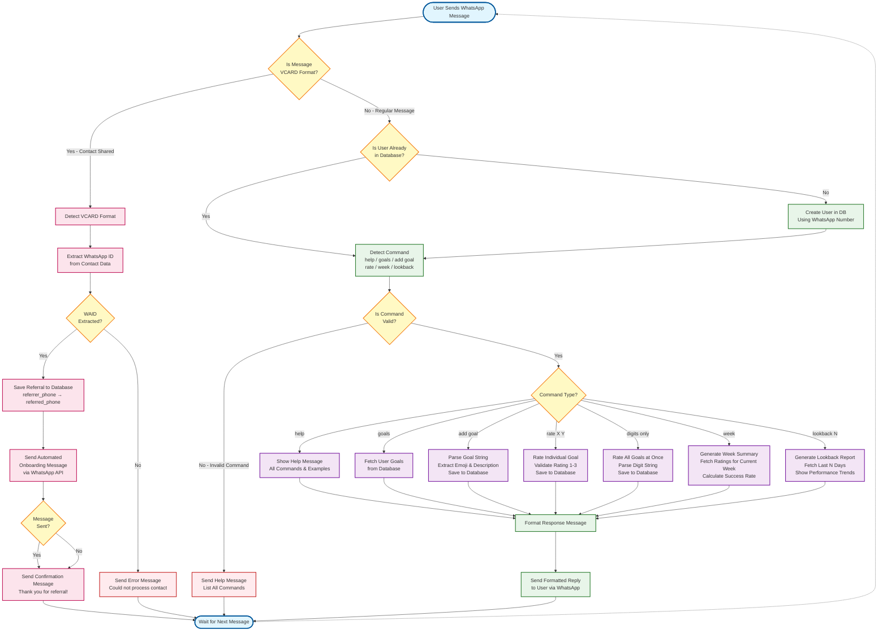

# User Flow Diagram

## Overview
This diagram illustrates the complete user interaction flow for the Life Bot application, including both **regular message processing** and the new **contact sharing/referral system**.

## Key Updates
- ✅ Added contact sharing detection (VCARD format)
- ✅ Added referral tracking flow
- ✅ Added automated onboarding message flow
- ✅ Updated command list to reflect current features

## User Journey

### Regular Message Flow
1. User sends text command via WhatsApp
2. System checks if user exists (creates if new)
3. Detects and validates command
4. Executes command logic against database
5. Returns formatted response

### Contact Sharing Flow (NEW)
1. User shares a contact via WhatsApp
2. System detects VCARD format
3. Extracts WhatsApp ID (WAID) from contact data
4. Saves referral record to database
5. Sends automated onboarding message to referred contact
6. Returns confirmation to referrer

## Diagram



## Flow Details

### 1. Entry Point
- **Start**: User sends any type of message via WhatsApp
- Message is delivered to Flask `/process` endpoint as JSON payload

### 2. Message Type Detection (NEW)
- **VCARD Format Check**: Determines if message is contact sharing (VCARD format)
  - VCARD Format: `BEGIN:VCARD\n...TEL;type=CELL;waid=...END:VCARD`
  - Regular Message: Plain text command

### 3. Contact Sharing Flow (NEW - Pink Nodes)
When VCARD is detected:
1. **Extract WAID**: Parse WhatsApp ID from VCARD data using regex pattern `waid=(\d+)`
2. **Save Referral**: Store referral record in database
   - Fields: `referrer_phone`, `referred_phone`, `referred_waid`, `status`
   - Duplicate check prevents multiple referrals
3. **Send Onboarding**: Automatically send welcome message to referred contact
   - Uses external WhatsApp API (port 3000)
   - Includes quick start guide and command examples
4. **Confirm**: Send thank you message to referrer
5. **Wait**: Return to listening state

### 4. Regular Message Flow (Green/Purple Nodes)

#### User Management
- **Check User**: Query database for existing user by phone number
- **Create User**: If new, insert user record with phone number

#### Command Detection & Validation
- **Detect Command**: Parse message text to identify command type
- **Validate Command**: Check if command matches known patterns
- **Invalid Command**: Send help message listing all available commands

#### Command Routing & Execution (Purple Nodes)
Each command type is routed to specific handler:

| Command | Handler | Database Operation |
|---------|---------|-------------------|
| `help` | `show_help.py` | None (static response) |
| `goals` | `format_goals.py` | SELECT user_goals |
| `add goal 😴 Description` | `add_goal.py` | INSERT INTO user_goals |
| `rate 2 3` | `rate_individual_goal.py` | INSERT INTO goal_ratings |
| `123` (digits) | `handle_goal_ratings.py` | INSERT INTO goal_ratings (bulk) |
| `week` | `format_week_summary.py` | SELECT goal_ratings (current week) |
| `lookback 7` | `look_back_summary.py` | SELECT goal_ratings (last N days) |

#### Response
- **Format Response**: Convert database results to user-friendly message
- **Send Response**: Deliver formatted message to user via WhatsApp
- **Wait**: Return to listening state

### 5. Error Handling
- **Invalid VCARD**: If WAID cannot be extracted, send error message
- **Invalid Command**: Send help message with command list
- **API Failures**: Log error but confirm referral action to user

## Command Examples

### Regular Commands
```text
help                    → Show all commands
goals                   → List your goals
add goal 🏃 Run daily   → Add new goal
rate 1 3                → Rate goal #1 as success
123                     → Rate all goals (1=fail, 2=partial, 3=success)
week                    → Show current week summary
lookback 5              → Show last 5 days performance
```

### Contact Sharing (NEW)
```text
[User shares contact via WhatsApp]
→ Bot detects VCARD format
→ Extracts WAID and saves referral
→ Sends onboarding message to referred contact
→ Confirms action with referrer
```

## Database Interactions

### Tables Used
1. **user** - User registration
2. **user_goals** - Goal definitions
3. **goal_ratings** - Daily goal ratings
4. **referrals** - Referral tracking (NEW)

### CRUD Operations
- **CREATE**: New users, goals, ratings, referrals
- **READ**: Fetch goals, ratings for summaries
- **UPDATE**: None (append-only for ratings)
- **DELETE**: Soft delete for goals (is_active flag)

## External Dependencies
- **WhatsApp Messaging Platform**: Message delivery
- **Flask Backend**: Command processing (port 5000)
- **SQLite Database**: Data persistence
- **WhatsApp API Service**: Automated message sending (port 3000)

## Key Decision Points
1. **VCARD Detection**: Enables referral vs. command processing
2. **User Existence**: Determines if user creation needed
3. **Command Validation**: Routes to appropriate handler or help message
4. **Command Type**: Routes to specific execution logic

## Notes
- All message processing is synchronous (no async/queue)
- Database operations use connection pooling via Flask teardown
- Referral system requires external WhatsApp API service
- VCARD format is specific to WhatsApp contact sharing
- Rating scale: 1 (fail), 2 (partial success), 3 (full success)

