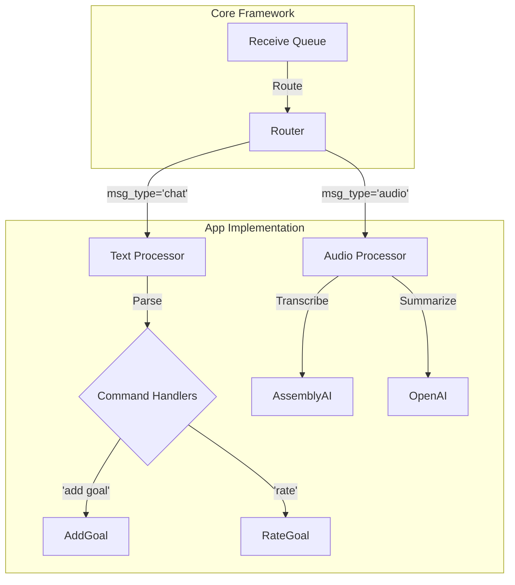

# 📦 App Implementation

This section details the implementation of the specific "LogLife Journaling App" built *on top* of the [Core Framework](../core/architecture.md).

---

## 🌟 Overview

The LogLife App consumes the `loglife.core` to provide specific features:

*   🎯 **Goal Tracking**: Set daily goals and rate them.
*   🎙️ **Audio Journaling**: Transcribe voice notes into text summaries.
*   ⏰ **Smart Reminders**: Send notifications at user-specific local times.

---

## 🧱 Architecture

The App is just a consumer of the Core's `router-worker`.

---

## 🛠️ Feature Implementation

### Goal Management (`loglife.app.logic.text`)

Text commands use a **State Machine** pattern.

1.  User sends "add goal".
2.  System checks `users` table for current state.
3.  If state is `awaiting_reminder_time`, next message is treated as the time.

### Audio Journaling (`loglife.app.logic.audio`)

1.  **Download**: Fetches media from WhatsApp.
2.  **Transcribe**: Sends audio to AssemblyAI.
3.  **Summarize**: Sends transcript to OpenAI GPT-4.
4.  **Store**: Saves to `audio_journals`.

### Reminders (`loglife.app.services.reminder`)

The **Reminder Service** is a standalone daemon thread.

*   Runs every **60 seconds**.
*   Queries `user_goals` for users whose `reminder_time` matches `current_time` (in their Timezone).
*   Calls `core.send_msg()` to notify them.

---

## 💾 Database

The app stores data in SQLite. See the [Database Schema](database.md) for details.
