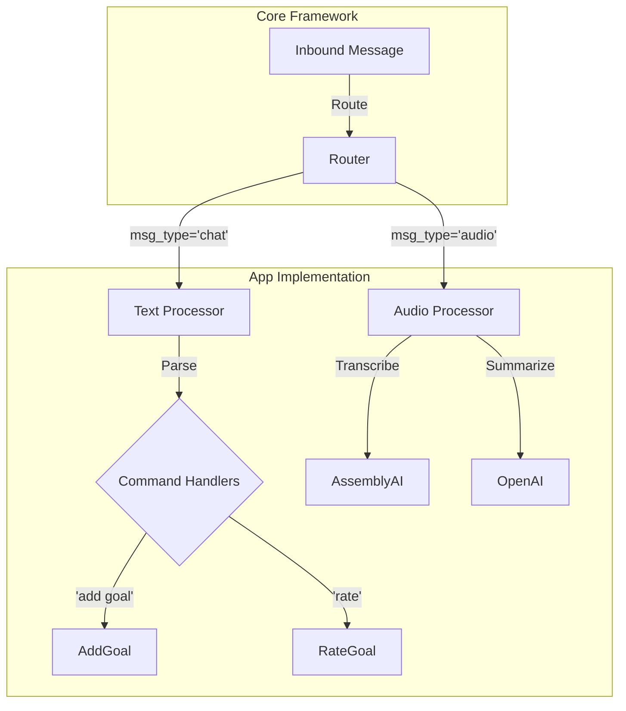

# 📦 App Implementation

This section details the implementation of the specific "LogLife Journaling App" built *on top* of the [Core Framework](../core/architecture.md).

---

## 🌟 Overview

The LogLife App consumes the `loglife.core` to provide specific features:

*   🎯 **Goal Tracking**: Set daily goals and rate them.
*   🎙️ **Audio Journaling**: Transcribe voice notes into text summaries.
*   ⏰ **Smart Reminders**: Send notifications at user-specific local times.

---

## 🧱 Architecture

The App is just a consumer of the Core's `router-worker`.

---

## 🛠️ Feature Implementation

### Goal Management (`loglife.app.logic.text`)

Text commands use a **State Machine** pattern.

1.  User sends "add goal".
2.  System checks `user_states` table.
3.  If state is `WAIT_GOAL_NAME`, next message is treated as the name.

### Audio Journaling (`loglife.app.logic.audio`)

1.  **Download**: Fetches media from WhatsApp.
2.  **Transcribe**: Sends audio to AssemblyAI.
3.  **Summarize**: Sends transcript to OpenAI GPT-4.
4.  **Store**: Saves to `audio_journal_entries`.

### Reminders (`loglife.app.services.reminder`)

The **Reminder Service** is a standalone daemon thread.

*   Runs every **60 seconds**.
*   Queries `user_goals` for users whose `reminder_time` matches `current_time` (in their Timezone).
*   Calls `core.send_msg()` to notify them.

---

## 🗄️ Database Schema

The App uses SQLite (`loglife.db`). Below are the main tables.

### `users`
Stores user profiles and settings.

| Column | Type | Description |
| :--- | :--- | :--- |
| `id` | `INTEGER` | Primary Key. |
| `phone_number` | `TEXT` | Unique international number. |
| `timezone` | `TEXT` | IANA Timezone ID (e.g., `America/New_York`). |
| `send_transcript_file` | `INTEGER` | `1` to send .txt file, `0` for summary only. |

### `user_goals`
Tracks the goals users have set for themselves.

| Column | Type | Description |
| :--- | :--- | :--- |
| `id` | `INTEGER` | Primary Key. |
| `user_id` | `INTEGER` | Foreign Key to `users`. |
| `goal_emoji` | `TEXT` | Visual icon for the goal. |
| `goal_description` | `TEXT` | Text of the goal. |
| `boost_level` | `INTEGER` | Importance/frequency multiplier. |

### `goal_ratings`
Daily performance scores for goals.

| Column | Type | Description |
| :--- | :--- | :--- |
| `id` | `INTEGER` | Primary Key. |
| `user_goal_id` | `INTEGER` | Foreign Key to `user_goals`. |
| `rating` | `INTEGER` | 1-3 stars (`1`: Bad, `2`: OK, `3`: Great). |
| `rating_date` | `DATETIME` | Timestamp of the rating. |

### `audio_journal_entries`
Stores transcripts and AI summaries of voice notes.

| Column | Type | Description |
| :--- | :--- | :--- |
| `id` | `INTEGER` | Primary Key. |
| `user_id` | `INTEGER` | Foreign Key to `users`. |
| `transcription_text` | `TEXT` | Raw speech-to-text output. |
| `summary_text` | `TEXT` | AI-generated summary. |

### `user_states`
Temporary storage for multi-step conversation flows.

| Column | Type | Description |
| :--- | :--- | :--- |
| `user_id` | `INTEGER` | Primary Key (One state per user). |
| `state` | `TEXT` | Current state (e.g., `WAIT_GOAL_NAME`). |
| `temp_data` | `TEXT` | JSON blob for state data. |

### `referrals`
Tracks who invited whom.

| Column | Type | Description |
| :--- | :--- | :--- |
| `referrer_user_id` | `INTEGER` | User who sent the invite. |
| `referred_user_id` | `INTEGER` | User who received the invite. |

For raw SQL definitions, see `src/loglife/app/db/schema.sql`.
