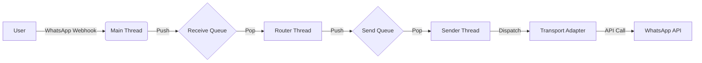

# 🏗️ Core Architecture

This document explains how the `loglife.core` framework handles messages, threading, and concurrency efficiently.

---

## 🔄 System Overview

The Framework is built on a **Producer-Consumer** architecture using Python's `queue.Queue`. This ensures that the Main Thread (the Web Server) is never blocked by slow operations like processing logic or making network calls.

---

## 🧵 Threading Model

The framework automatically manages the critical background threads for you.

| Thread | Role | Efficiency |
| :--- | :--- | :--- |
| **MainThread** | **Web Server**. Receives Webhook & pushes to `Receive Queue`. Returns `200 OK` instantly. | ⚡ **High**. Non-blocking. |
| **RouterWorker** | **Logic**. Consumes `Receive Queue`, processes logic (Text/Audio/VCard), and pushes replies to `Send Queue`. | 🐢 **Variable**. Depends on your code speed. |
| **SenderWorker** | **I/O Worker**. Pops from `Send Queue` and delegates to the correct Transport. | 🐢 **Medium**. Handles network latency. |

!!! tip "Why this matters"
    Because the **SenderWorker** is separate, your logic loop can queue 10 messages instantly and go back to listening for new inputs, while the Sender Thread handles the slow task of actually delivering them one by one.

---

## 📨 Unified Messaging

The core unifies all inputs (WhatsApp, Emulator, Tests) into a single `Message` object.

### Workflow

1.  **Ingestion**: Webhook receives JSON $\rightarrow$ Wraps in `Message` $\rightarrow$ Pushes to `Receive Queue`.
2.  **Consumption**: `RouterWorker` calls `recv_msg()`, which blocks until a message is available.
3.  **Production**: Your logic calls `send_msg()`, which wraps your text in a `Message` $\rightarrow$ Pushes to `Send Queue`.
4.  **Delivery**: `SenderWorker` wakes up $\rightarrow$ Pops message $\rightarrow$ Calls `transports.send_whatsapp_message` (or Emulator).

### Transport Layer

The system decouples **Threading** from **Protocols**.
*   **Threading**: `loglife.core.messaging` handles queues and workers.
*   **Transports**: `loglife.core.transports` handles the actual API calls (Requests to WhatsApp, SSE to Emulator).

---

## 🔌 API Reference

::: loglife.core
    options:
        members:
            - init
            - recv_msg
            - send_msg
            - Message
