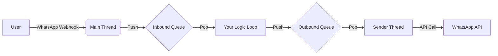

# 🏗️ Core Architecture

This document explains how the `loglife.core` framework handles messages, threading, and concurrency efficiently.

---

## 🔄 System Overview

The Framework is built on a **Producer-Consumer** architecture using Python's `queue.Queue`. This ensures that the Main Thread (the Web Server) is never blocked by slow operations like processing logic or making network calls.

---

## 🧵 Threading Model

The framework automatically manages the critical background threads for you.

| Thread | Role | Efficiency |
| :--- | :--- | :--- |
| **MainThread** | **Web Server**. Receives Webhook & pushes to `Inbound Queue`. Returns `200 OK` instantly. | ⚡ **High**. Non-blocking. |
| **Your Loop** | **Logic**. You call `core.recv_msg()`. This is where your business logic lives. | 🐢 **Variable**. Depends on your code speed. |
| **SenderThread** | **I/O Worker**. Pops from `Outbound Queue` and calls WhatsApp API. | 🐢 **Medium**. Handles network latency. |

!!! tip "Why this matters"
    Because the **SenderThread** is separate, your logic loop can queue 10 messages instantly and go back to listening for new inputs, while the Sender Thread handles the slow task of actually delivering them one by one.

---

## 📨 Unified Messaging

The core unifies all inputs (WhatsApp, Emulator, Tests) into a single `Message` object.

### Workflow

1.  **Ingestion**: Webhook receives JSON $\rightarrow$ Wraps in `Message` $\rightarrow$ Pushes to `Inbound Queue`.
2.  **Consumption**: You call `recv_msg()`, which blocks until a message is available.
3.  **Production**: You call `send_msg()`, which wraps your text in a `Message` $\rightarrow$ Pushes to `Outbound Queue`.
4.  **Delivery**: `SenderThread` wakes up $\rightarrow$ Pops message $\rightarrow$ Calls external API.

---

## 🔌 API Reference

::: loglife.core
    options:
        members:
            - init
            - recv_msg
            - send_msg
            - Message
