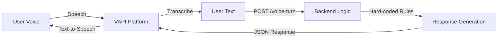
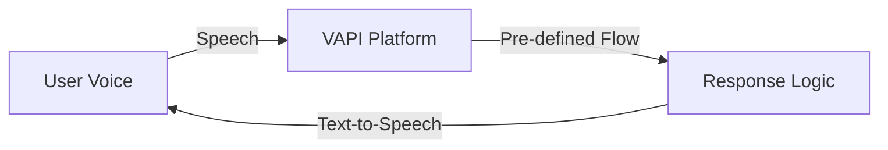
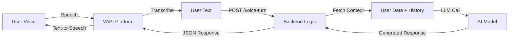

# 🎙️ VAPI Conversational AI

LogLife uses [VAPI](https://vapi.ai) to enable voice conversations with users. This document explains the three different approaches for implementing conversational AI with VAPI.

---

## 📋 Overview

VAPI provides a platform for building voice AI assistants. When a user initiates a voice call through LogLife, VAPI handles the speech-to-text conversion and calls your backend endpoint to generate responses. The backend can implement conversational logic in three different ways:

| Approach | Status | Description |
| :--- | :--- | :--- |
| **Mixed/Hybrid** | ✅ Supported | Combination of AI model and hard-coded business logic |
| **Static** | ✅ Supported | Pre-defined conversation flows without AI model |
| **Dynamic** | ❌ Not Yet Supported | Fully AI-driven conversations with dynamic configuration |

---

## 🔀 Mixed/Hybrid Approach (Current Implementation)

The **Mixed/Hybrid** approach combines VAPI's AI capabilities (speech-to-text) with hard-coded business logic in the backend. This is the current implementation in LogLife.

### How It Works



### Implementation

1. **VAPI Configuration**: VAPI assistant is configured with a server URL endpoint (`/voice-turn`)
2. **Speech Processing**: VAPI converts user speech to text
3. **Backend Call**: VAPI sends the transcribed text to your backend endpoint:
   ```json
   {
     "external_user_id": "user_token_or_phone",
     "user_text": "What are my habits?",
     "mode": "daily_checkin"
   }
   ```
4. **Hard-coded Logic**: Backend processes the text using predefined rules and business logic
5. **Response**: Backend returns a JSON response:
   ```json
   {
     "reply_text": "You have 3 habits:\n• 📚 Read 30 mins\n• 💪 Exercise\n• 🧘 Meditate"
   }
   ```
6. **Speech Synthesis**: VAPI converts the response text back to speech

### Current Implementation

The current implementation in ```124:189:src/loglife/core/routes/voice/routes.py``` shows this approach:

- **Mode Detection**: Checks the `mode` field to determine conversation type
- **Pattern Matching**: Uses regex to detect specific user intents (e.g., asking about habits)
- **Database Queries**: Fetches user data from the database
- **Response Formatting**: Formats responses using hard-coded templates

### Advantages

- ✅ **Full Control**: Complete control over conversation flow and responses
- ✅ **Predictable**: Responses are deterministic and testable
- ✅ **Cost-Effective**: No LLM API costs for response generation
- ✅ **Fast**: No AI model inference latency

### Limitations

- ❌ **Limited Flexibility**: Cannot handle unexpected user inputs naturally
- ❌ **Maintenance**: Requires code changes for new conversation patterns
- ❌ **Scalability**: Hard to scale to complex multi-turn conversations

---

## 📝 Static Approach

The **Static** approach uses pre-defined conversation flows configured entirely within VAPI, without any backend logic for response generation.

### How It Works



### Implementation

1. **VAPI Configuration**: Conversation flows are configured directly in VAPI's dashboard
2. **No Backend Calls**: VAPI handles all conversation logic internally
3. **Pre-defined Responses**: Responses are static templates or simple conditional logic
4. **Variables**: Can use variables from VAPI's context (e.g., user name, session data)

### Use Cases

- Simple FAQ bots
- Menu navigation systems
- Information lookup (e.g., "What's the weather?")
- Pre-recorded message playback

### Advantages

- ✅ **Simple**: No backend code required
- ✅ **Fast**: No network latency for response generation
- ✅ **Reliable**: No dependency on backend availability

### Limitations

- ❌ **Limited Intelligence**: Cannot access dynamic data (e.g., user's goals from database)
- ❌ **No Personalization**: Cannot customize responses based on user context
- ❌ **Rigid**: Difficult to handle complex, multi-turn conversations

---

## 🤖 Dynamic Approach (Not Yet Supported)

The **Dynamic** approach uses an AI model (LLM) to generate responses dynamically based on conversation context, user data, and system prompts.

### How It Would Work



### Proposed Implementation

1. **VAPI Configuration**: VAPI assistant configured with server URL endpoint
2. **Context Gathering**: Backend fetches relevant user data and conversation history
3. **LLM Integration**: Backend calls an LLM (e.g., OpenAI GPT-4, Anthropic Claude) with:
   - System prompt defining the assistant's role
   - User's conversation history
   - Current user data (goals, habits, etc.)
   - Current user message
4. **Dynamic Response**: LLM generates a contextual, natural response
5. **Response Return**: Backend returns the AI-generated response to VAPI

### Advantages

- ✅ **Natural Conversations**: Handles unexpected inputs gracefully
- ✅ **Contextual**: Responses adapt to user's history and current state
- ✅ **Scalable**: Easy to add new conversation capabilities without code changes
- ✅ **Personalized**: Can provide highly personalized responses

### Limitations

- ❌ **Cost**: LLM API calls can be expensive at scale
- ❌ **Latency**: AI inference adds response time
- ❌ **Unpredictability**: Responses may vary and need careful prompt engineering
- ❌ **Complexity**: Requires prompt engineering and context management

### Future Implementation

When implementing the dynamic approach, consider:

- **Caching**: Cache common responses to reduce LLM calls
- **Streaming**: Use streaming responses for better user experience
- **Fallbacks**: Implement fallback to hybrid approach if LLM fails
- **Rate Limiting**: Protect against excessive LLM API usage
- **Prompt Templates**: Maintain versioned prompt templates for different conversation modes

---

## 🔧 Technical Details

### Voice Turn Endpoint

The backend endpoint `/voice-turn` handles voice conversation requests:

**Endpoint**: `POST /voice-turn`

**Headers**:
```
x-api-key: my-super-secret-123
```

**Request Body**:
```json
{
  "external_user_id": "user_token_or_phone",
  "user_text": "What are my habits?",
  "mode": "daily_checkin"
}
```

**Response**:
```json
{
  "reply_text": "You have 3 habits:\n• 📚 Read 30 mins\n• 💪 Exercise\n• 🧘 Meditate"
}
```

**Special Response Format**: To end the call, include `endCall=true` in the response:
```json
{
  "reply_text": "Thank you for calling. Goodbye! endCall=true"
}
```

### Supported Modes

Currently, the following modes are supported in the mixed/hybrid approach:

- `daily_checkin`: Daily habit check-in conversation
- `goal_setup`: Goal setup and configuration
- `temptation_support`: Support during temptation moments
- `onboarding`: New user onboarding flow

### Frontend Integration

The frontend call page (```website/app/call/[number]/[token]/page.tsx```) initializes VAPI and starts voice calls:

- Maps call numbers to VAPI assistant IDs
- Passes `external_user_id` as a variable to VAPI
- Handles call events (start, end, errors)

---

## 📚 Related Documentation

- [Core Architecture](architecture.md): Understanding the overall system architecture
- [WhatsApp Flow](whatsapp-flow.md): How WhatsApp integration works
- [API Reference - Routes](../api/backend/routes.md): Detailed API documentation

