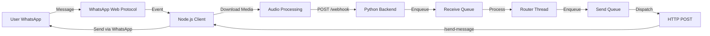
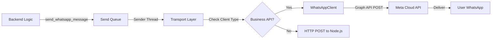

## WhatsApp API Flows: Web vs Business API

LogLife supports two different WhatsApp integration methods, each with distinct message flows and capabilities.

### Overview

| Feature | WhatsApp Web API | WhatsApp Business API |
| :--- | :--- | :--- |
| **Technology** | `whatsapp-web.js` (Node.js) | Meta Graph API (Official) |
| **Authentication** | QR Code scan | Access Token + Phone Number ID |
| **Incoming Endpoint** | `/webhook` (from Node.js client) | `/whatsapp-incoming` (from Meta) |
| **Outgoing Method** | HTTP POST to Node.js client | Direct Graph API calls |
| **Interactive Messages** | ❌ Not supported | ✅ Buttons, Lists, CTA URLs |
| **Configuration** | `WHATSAPP_CLIENT_TYPE=web` (default) | `WHATSAPP_CLIENT_TYPE=business_api` |

### WhatsApp Web API Flow

The **WhatsApp Web API** uses a Node.js client that connects to WhatsApp Web, similar to how you use WhatsApp on your computer.

#### Incoming Messages Flow



**Steps:**

1. **User sends message** → WhatsApp Web protocol receives it
2. **Node.js client** (`whatsapp-client/index.js`) listens for messages
3. **Media handling**: If audio, downloads and encodes as base64
4. **Forward to backend**: POST to `/webhook` with standardized payload:
   ```json
   {
     "sender": "923325727426",
     "raw_msg": "message text or base64 audio",
     "msg_type": "chat",
     "client_type": "whatsapp"
   }
   ```
5. **Backend processes** → Enqueues to Receive Queue → Router processes → Enqueues reply to Send Queue
6. **Sender thread** → HTTP POST to `http://localhost:3001/send-message`
7. **Node.js client** → Sends message via WhatsApp Web protocol

#### Outgoing Messages Flow


**Implementation:**

```116:156:src/loglife/core/transports.py
def send_whatsapp_message(
    number: str, message: str, attachments: dict[str, Any] | None = None
) -> None:
    """Send a message via WhatsApp Web JS client or WhatsApp Business API based on config."""
    client_type = WHATSAPP_CLIENT_TYPE.lower()

    if client_type == "business_api":
        # Use WhatsApp Business API
        try:
            client = get_whatsapp_business_client()
            formatted_number = format_phone_for_business_api(number)

            # Send text message
            client.send_text(to=formatted_number, text=message)

            # Handle attachments (transcript files) if present
            if attachments and "transcript_file" in attachments:
                # Note: Business API doesn't support sending files directly via text messages
                # You would need to upload the file first and then send it as a document
                # For now, we'll log a warning
                logger.warning(
                    "Attachments are not yet fully supported with WhatsApp Business API. "
                    "Transcript file will not be sent."
                )
        except Exception as exc:
            error = f"Error sending WhatsApp Business API message > {exc}"
            logger.exception(error)
            raise RuntimeError(error) from exc
    else:
        # Default: Use WhatsApp Web JS client
        payload = {"number": number, "message": message}
        if attachments:
            payload["attachments"] = attachments

        headers = {"Content-Type": "application/json"}
        try:
            requests.post(WHATSAPP_API_URL, json=payload, headers=headers, timeout=30)
        except Exception as exc:
            error = f"Error sending WhatsApp message > {exc}"
            logger.exception(error)
            raise RuntimeError(error) from exc
```

### WhatsApp Business API Flow

The **WhatsApp Business API** uses Meta's official Graph API, providing enterprise-grade features and interactive message support.

#### Incoming Messages Flow

<div class="mermaid">
graph LR
    A[User WhatsApp] --> B[Meta API]
    B --> C[Webhook]
    C --> D[Receive Queue]
    D --> E[Router]
    E --> F[Send Queue]
    F --> G[API Call]
    G --> B
    B --> A
</div>

**Steps:**

1. **User sends message** → Meta WhatsApp Cloud API receives it
2. **Meta webhook** → POST to `/whatsapp-incoming` with Meta's payload format
3. **Payload transformation**: Extracts message content and normalizes format:
   ```python
   # Meta format: {"entry": [{"changes": [{"value": {"messages": [...]}}]}]}
   # Transformed to: {"sender": "...", "raw_msg": "...", "msg_type": "chat", "client_type": "whatsapp"}
   ```
4. **Forward to unified webhook**: Internally calls `/webhook` with standardized payload
5. **Backend processes** → Same queue-based flow as Web API
6. **Sender thread** → Direct Graph API call to Meta
7. **Meta delivers** → Message sent to user

**Webhook Verification:**

```47:65:src/loglife/core/routes/webhook/routes.py
def _handle_webhook_verification() -> ResponseReturnValue:
    """Handle webhook verification (GET request).

    Returns:
        Response with challenge if verification succeeds, error response otherwise.
    """
    mode = request.args.get("hub.mode")
    token = request.args.get("hub.verify_token")
    challenge = request.args.get("hub.challenge")

    if mode == "subscribe" and token == VERIFY_TOKEN:
        logger.info("Webhook verified successfully")
        # Return the challenge as plain text (not JSON)
        return Response(challenge, mimetype="text/plain"), 200

    logger.warning(
        "Webhook verification failed: mode=%s, token_match=%s", mode, token == VERIFY_TOKEN
    )
    return error_response("Verification failed", status_code=403)
```

#### Outgoing Messages Flow



**Implementation:**

The transport layer automatically routes to the correct API based on `WHATSAPP_CLIENT_TYPE`:

```116:143:src/loglife/core/transports.py
def send_whatsapp_message(
    number: str, message: str, attachments: dict[str, Any] | None = None
) -> None:
    """Send a message via WhatsApp Web JS client or WhatsApp Business API based on config."""
    client_type = WHATSAPP_CLIENT_TYPE.lower()

    if client_type == "business_api":
        # Use WhatsApp Business API
        try:
            client = get_whatsapp_business_client()
            formatted_number = format_phone_for_business_api(number)

            # Send text message
            client.send_text(to=formatted_number, text=message)

            # Handle attachments (transcript files) if present
            if attachments and "transcript_file" in attachments:
                # Note: Business API doesn't support sending files directly via text messages
                # You would need to upload the file first and then send it as a document
                # For now, we'll log a warning
                logger.warning(
                    "Attachments are not yet fully supported with WhatsApp Business API. "
                    "Transcript file will not be sent."
                )
        except Exception as exc:
            error = f"Error sending WhatsApp Business API message > {exc}"
            logger.exception(error)
            raise RuntimeError(error) from exc
```

### Key Differences

#### 1. **Incoming Message Handling**

**Web API:**
- Node.js client actively listens via WhatsApp Web protocol
- Client downloads media and forwards to backend
- Endpoint: `/webhook` (called by Node.js client)

**Business API:**
- Meta sends webhooks to your server
- Endpoint: `/whatsapp-incoming` (called by Meta)
- Transforms Meta payload format to unified format
- Forwards internally to `/webhook` for unified processing

#### 2. **Outgoing Message Handling**

**Web API:**
- Backend → HTTP POST to Node.js client (`/send-message`)
- Node.js client → Sends via WhatsApp Web protocol
- Requires Node.js client to be running

**Business API:**
- Backend → Direct Graph API call to Meta
- No intermediate service required
- Uses access token authentication

#### 3. **Interactive Messages**

**Web API:**
- ❌ Buttons, lists, and CTA URLs not supported
- Falls back to plain text messages

**Business API:**
- ✅ Full support for interactive messages
- Reply buttons, list messages, CTA URLs, voice call buttons
- See `send_whatsapp_reply_buttons()`, `send_whatsapp_list_message()`, etc.

#### 4. **Configuration**

Set the client type via environment variable:

    # For WhatsApp Web API (default)
    WHATSAPP_CLIENT_TYPE=web

    # For WhatsApp Business API
    WHATSAPP_CLIENT_TYPE=business_api
    WHATSAPP_ACCESS_TOKEN=your_access_token
    WHATSAPP_PHONE_NUMBER_ID=your_phone_number_id

### Unified Processing

Regardless of which API is used, both flows converge at the unified messaging layer:

1. **Message ingestion** → Both create `Message` objects with `client_type` field
2. **Queue processing** → Same `Receive Queue` → `Router Thread` → `Send Queue` flow
3. **Transport dispatch** → `Sender Thread` routes to correct transport based on `client_type`

This architecture allows the same business logic to work with either API, with only the transport layer differing.

---