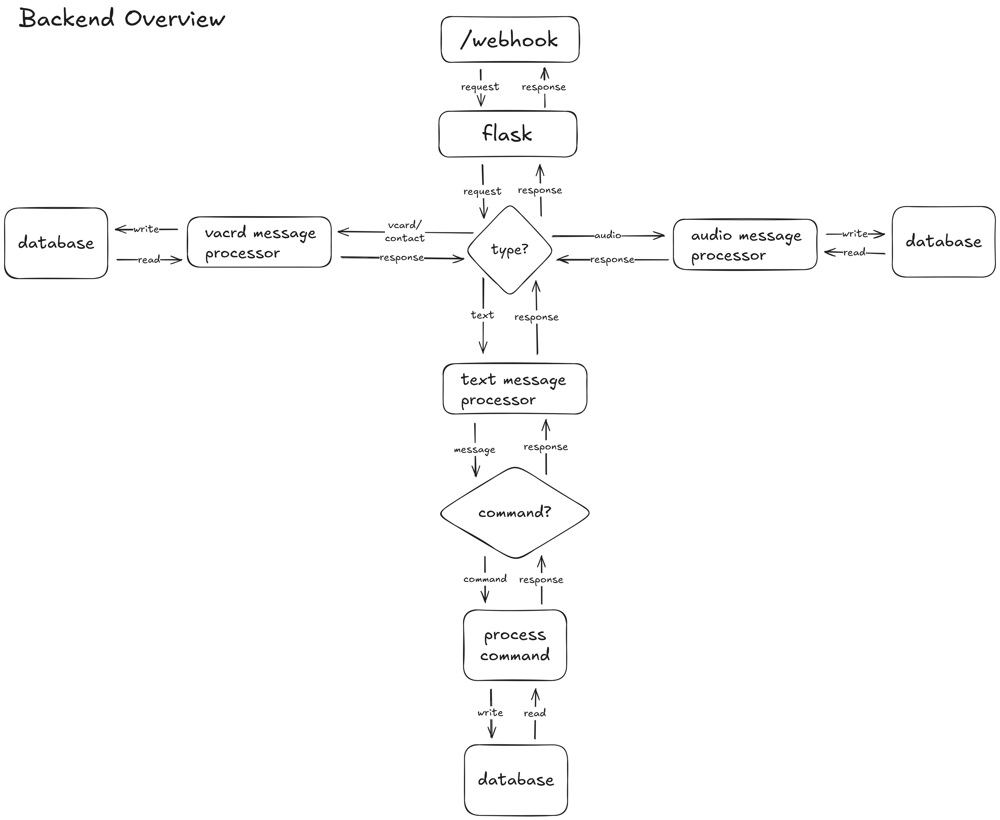

# Life Bot Backend Documentation

---

## Overview

The Life Bot backend is built with Python and Flask. It handles goal tracking, audio journaling, referrals, and daily reminders.

**Technology Stack:**

- Python 3.11+
- Flask
- SQLite



<small>_Tip: Click the image to zoom._</small>

---

## Requirements

**Basic operation:**

- Python 3.11+

**Full feature set:**

- WhatsApp Client service on port 3000
- AssemblyAI API account (audio transcription)
- OpenAI API account (AI summarization)

---

## Setup

### Running

Start the backend from the root directory:

```bash
uv run backend/main.py
```

**Note:** `uv sync` runs automatically when you use `uv run`, so dependencies are installed automatically.

---

## Core Features

### Goal Management

**Technical Implementation:**

Text commands are processed through a state machine pattern:

1. WhatsApp Client sends text message to `/webhook` with `msg_type: "chat"`
2. Backend routes to `process_message()` function
3. Checks `user_states` table for ongoing multi-step flows (e.g., adding goal)
4. Parses command using regex patterns and text helpers
5. Executes database operations (create, read, update)
6. Updates conversation state if needed
7. Returns formatted response

**Command Processing:**

- **Goal operations:** `add goal`, `goals`, `rate`, `week`, `lookback`
- **State management:** Multi-step flows stored in `user_states` table
- **Text parsing:** Modular helpers for each command type
- **Validation:** Input validation before database operations

**Key files:**

<<<<<<< HEAD
- `app/logic/process_text.py` — Main command routing logic
=======
- `app/logic/process_message.py` — Main command routing logic
>>>>>>> 6323348 (completed updated documentation)
- `app/helpers/text/goal.py` — Goal text parsing utilities
- `app/helpers/text/rate.py` — Rating command parser
- `app/helpers/text/week.py` — Week summary formatter
- `app/db/operations/user_goals.py` — Goal database operations
- `app/db/operations/goal_ratings.py` — Rating database operations
- `app/db/operations/user_states.py` — Conversation state management

### Audio Journaling

**Technical Implementation:**

1. WhatsApp Client receives audio message, downloads media, encodes as base64
2. Backend receives base64 audio via `/webhook` endpoint
3. Backend calls AssemblyAI API for transcription
4. Backend calls OpenAI GPT API for summarization
5. Stores transcript + summary in `audio_journal_entries` table
6. Returns summary to user via WhatsApp Client API

**Supported formats:** OGG, MP3, WAV, M4A

**Key files:**

- `app/logic/process_audio.py` — Audio processing logic
- `app/helpers/audio/transcribe_audio.py` — AssemblyAI integration
- `app/helpers/audio/summarize_transcript.py` — OpenAI integration

### Goal Reminders

**Technical Implementation:**

- Custom threading-based scheduler (no APScheduler dependency)
- Daemon thread runs continuously, checks reminders in user timezones
- Calculates next reminder window dynamically
- Sends reminders via WhatsApp Client `/send-message` API

**Timezone handling:**

- Detects user timezone from phone number using `phonenumbers` library
- Converts UTC time to user's local timezone using `zoneinfo`
- Supports all IANA timezone identifiers

**Key files:**

- `app/services/reminder.py` — Reminder scheduling service
- `app/helpers/webhook/get_timezone.py` — Timezone detection
- `app/helpers/text/reminder_time.py` — Time format parsing

### Referrals

**Technical Implementation:**

1. WhatsApp Client detects VCARD message type, sends to `/webhook`
2. Backend parses VCARD format, extracts phone number
3. Checks for duplicate referrals in `referrals` table
4. Creates new user record if doesn't exist
5. Calls WhatsApp Client API to send onboarding message
6. Returns confirmation to referrer

**VCARD parsing:**

- Uses `vobject` library for parsing
- Extracts phone numbers from TEL fields
- Validates and formats phone numbers

**Key files:**

- `app/logic/process_vcard.py` — VCARD processing logic
- `app/helpers/vcard/vcard.py` — VCARD parsing utilities
- `app/db/operations/referrals.py` — Referral database operations

---

## Database

The backend uses SQLite with the following main tables:

| Table | Purpose |
|-------|---------|
| `user` | User profiles with phone and timezone |
| `user_goals` | Goals with boost levels and reminder times |
| `goal_ratings` | Daily goal ratings (1-3) |
| `referrals` | Referral tracking |
| `user_states` | Conversation state for multi-step flows |
| `audio_journal_entries` | Audio transcripts and summaries |

**Database file:** `backend/db/life_bot.db`

**Schema file:** `backend/db/schema.sql`

---

## Key Components

**Main directories:**

- `app/db/` - Database layer and data access
- `app/helpers/` - Utility functions (referrals, reminders, timezone)
- `app/logic/` - Message processing and command routing
- `app/routes/` - Flask API endpoints
- `db/` - SQLite database file and schema

---
