# User Flow Guide

## Overview
This guide shows you how to use Life Bot to track your goals, journal with voice notes, and share the app with friends.

## What You Can Do
- 🎙️ **Voice Journaling** - Send voice notes and get instant AI summaries
- 🎯 **Goal Tracking** - Create goals, set reminders, and track your progress
- ⏰ **Daily Reminders** - Get reminded at your chosen time every day
- 👥 **Share with Friends** - Invite others by sharing their contact

## How It Works

### 🎙️ Voice Journaling
1. Record and send a voice note in WhatsApp
2. Life Bot transcribes your audio
3. AI creates a summary of what you said
4. You receive the summary instantly
5. Your journal entry is saved for future reference

**Why it's useful**: Quickly capture thoughts without typing. Perfect for daily reflections, ideas, or notes on the go.

### 🎯 Creating Goals with Reminders
1. Send a message like "add goal 🏃 Morning run"
2. Life Bot asks what time you want to be reminded
3. Reply with your preferred time (e.g., "6:30 AM")
4. Get daily WhatsApp reminders at that time
5. Rate your progress each day

**Why it's useful**: Stay consistent with your goals through daily reminders tailored to your schedule.

### 📊 Tracking Your Progress
1. Send commands to view your goals
2. Rate how you did each day (simple numbers)
3. Check weekly summaries to see trends
4. Review past performance to stay motivated

**Why it's useful**: See your progress over time and identify patterns in your habits.

### 👥 Sharing with Friends
1. Share a contact through WhatsApp
2. Life Bot welcomes your friend automatically
3. They're ready to start tracking their goals
4. You get a confirmation message

**Why it's useful**: Help friends improve their lives with the same tools that work for you.

## User Flow Diagram

```mermaid
flowchart TB
    Start([Send a Message])
    
    Start --> What{What do you<br/>want to do?}
    
    %% Voice Journaling
    What -->|🎙️ Send Voice Note| Voice[Record your thoughts]
    Voice --> Transcribe[Bot transcribes your audio]
    Transcribe --> Summarize[AI creates a summary]
    Summarize --> SaveJournal[Your entry is saved]
    SaveJournal --> GetSummary[Receive your summary]
    GetSummary --> Done
    
    %% Add Goal
    What -->|🎯 Create a Goal| AddGoal[Send: add goal 🏃 Morning run]
    AddGoal --> AskTime[Bot asks: What time?]
    AskTime --> SendTime[Reply: 6:30 AM]
    SendTime --> Confirmed[Daily reminder set!]
    Confirmed --> Done
    
    %% View/Track Goals
    What -->|📊 Track Progress| Commands{Choose action}
    Commands -->|See my goals| ShowGoals[Send: goals]
    Commands -->|Rate today| RateGoals[Send: 133<br/>1=didn't do, 3=completed]
    Commands -->|Weekly summary| WeekView[Send: week]
    Commands -->|Past performance| LookBack[Send: lookback 7]
    ShowGoals --> GetInfo[See your goal list]
    RateGoals --> GetInfo[Progress recorded]
    WeekView --> GetInfo[See weekly stats]
    LookBack --> GetInfo[See past trends]
    GetInfo --> Done
    
    %% Share
    What -->|👥 Invite a Friend| Share[Share contact via WhatsApp]
    Share --> Welcome[Friend gets welcome message]
    Welcome --> ThankYou[You get confirmation]
    ThankYou --> Done
    
    %% Help
    What -->|❓ Need Help| Help[Send: help]
    Help --> ShowCommands[See all commands]
    ShowCommands --> Done
    
    Done([Continue using Life Bot])
    Done -.-> Start
    
    %% Styling
    classDef startEnd fill:#e1f5fe,stroke:#01579b,stroke-width:3px
    classDef decision fill:#fff9c4,stroke:#f57f17,stroke-width:2px
    classDef action fill:#e8f5e9,stroke:#2e7d32,stroke-width:2px
    classDef result fill:#f3e5f5,stroke:#7b1fa2,stroke-width:2px
    classDef voice fill:#e0f2f1,stroke:#004d40,stroke-width:2px
    
    class Start,Done startEnd
    class What,Commands decision
    class AddGoal,SendTime,ShowGoals,RateGoals,WeekView,LookBack,Share,Help action
    class Voice,Transcribe,Summarize voice
    class SaveJournal,GetSummary,AskTime,Confirmed,GetInfo,Welcome,ThankYou,ShowCommands result
```



## Feature Details

### 🎙️ Voice Journaling

**What happens when you send a voice note:**
1. Life Bot receives your audio
2. It converts your speech to text (transcription)
3. AI reads the transcript and creates a short summary
4. You get the summary back instantly
5. Both the full transcript and summary are saved for you

**What you'll see:**
- "Audio received. Transcribing..." _(takes 10-30 seconds)_
- "Audio transcribed. Summarizing..." _(takes 5-10 seconds)_
- "Summary stored in Database."
- Your personalized summary

**Supported formats:** Voice messages and audio files (OGG, MP3, WAV, M4A)

### 🎯 Goal Creation & Reminders

**Setting up a goal:**
1. Tell Life Bot about your goal (with an emoji for easy recognition)
2. Life Bot asks when you want daily reminders
3. You reply with your preferred time
4. You'll get a WhatsApp message every day at that time

**Time formats you can use:**
- `6:30 AM` or `6:30 PM` (with AM/PM)
- `18:00` (24-hour format)
- `6pm` or `6am` (casual)
- `6` (assumes morning)

**Your timezone:** Automatically detected from your phone number, so reminders arrive at the right local time.

### 📊 Progress Tracking

**Ways to check your progress:**

**See your goals:** Send `goals` to see all your active goals with their reminder times

**Rate your day:** Send numbers like `133` where:
- `1` = Didn't do it
- `2` = Partially completed
- `3` = Fully completed

**Weekly summary:** Send `week` to see how you did this week with success rates

**Look back:** Send `lookback 7` to review the past 7 days (or any number of days)

### 👥 Inviting Friends

**How to share Life Bot:**
1. Open WhatsApp and share a friend's contact with Life Bot
2. Life Bot automatically sends them a welcome message
3. You get a confirmation
4. Your friend can start using Life Bot right away

### ❓ Getting Help

**Stuck or forgot a command?** Just send `help` to see all available commands with examples.

## Quick Start Examples

### 🎙️ Voice Note Example
```
[You record: "Today I completed my morning run and felt great. 
I also finished that work project I've been putting off. 
Feeling really productive!"]

Bot: Audio received. Transcribing...
Bot: Audio transcribed. Summarizing...
Bot: Summary stored in Database.
Bot: Summary:
     You had a productive day, completing your morning run 
     and finishing a work project you'd been delaying. 
     You're feeling accomplished.
```

### 🎯 Create a Goal
```
You: add goal 🏃 Morning run

Bot: ✅ Goal added: 🏃 Morning run
     🔥 Boost level set to 1 (default).
     ⏰ What time should I remind you daily? 
        (e.g., 18:00, 6 PM, 6pm)

You: 6:30 AM

Bot: ✅ Reminder set for 6:30 AM daily!
     Your goal is now active with daily reminders.
```

### 📊 Track Your Progress
```
You: goals
Bot: Your goals:
     1. 🏃 Morning run (Reminder: 6:30 AM)
     2. 📚 Read for 30 mins (Reminder: 9:00 PM)
     3. 💧 Drink 8 glasses water (Reminder: 8:00 AM)

You: 133
     (Goal 1: didn't do | Goal 2: completed | Goal 3: completed)
Bot: ✅ Ratings saved for today!

You: week
Bot: 📊 This week: 67% success rate
     🏃 Morning run: 4/7 days
     📚 Read: 5/7 days  
     💧 Water: 6/7 days
```

### 👥 Invite a Friend
```
[You share your friend John's contact]

Bot: Thank you! I've sent an onboarding message to John.

[John receives welcome message from Life Bot]
```

### ❓ Get Help
```
You: help

Bot: 📱 Life Bot Commands:
     
     🎙️ Voice Journaling:
     • Send voice note → Get AI summary
     
     🎯 Goals:
     • add goal [emoji] [description] → Create goal
     • goals → See all goals
     
     📊 Track:
     • [digits] → Rate all goals (e.g., 133)
     • week → Weekly summary
     • lookback [days] → Review past days
     
     👥 Share:
     • Share contact → Invite friend
```

## What Makes Life Bot Work

### 🔒 Your Privacy & Data
- Your voice notes are transcribed by industry-standard AI services
- Summaries are generated by advanced AI (GPT models)
- All your data is saved securely and linked to your WhatsApp number
- Only you can access your goals, ratings, and journal entries

### ⏰ Smart Reminders
- Reminders are sent via WhatsApp at your chosen time
- Your timezone is automatically detected from your phone number
- No matter where you are, reminders arrive at the right local time
- You can change reminder times anytime

### 📱 Always Ready
- Life Bot responds instantly to your messages
- Works 24/7 - send messages whenever it's convenient for you
- Multi-step conversations (like setting up goals) remember where you left off

### 🌟 Key Features
- **Voice Journaling**: Speech-to-text + AI summaries in under a minute
- **Flexible Time Input**: Type times however you prefer (6pm, 18:00, 6 PM, etc.)
- **Progress Tracking**: Simple number-based rating system (1-2-3)
- **Weekly Insights**: See patterns in your habits and success rates
- **Easy Sharing**: Invite friends by sharing their contact

## Tips for Best Results

### 🎙️ Voice Notes
- Speak clearly and at a normal pace
- Keep recordings under 5 minutes for best results
- You can record in any language the AI supports
- Great for: daily reflections, capturing ideas, noting accomplishments

### 🎯 Goals
- Use emojis to make goals easy to recognize at a glance
- Set reminder times when you're most likely to complete the goal
- Start with 2-3 goals, add more as you build the habit
- Be specific: "🏃 Run 3km" is better than "🏃 Exercise"

### 📊 Ratings
- Rate consistently each day for better insights
- `1` = Didn't do it (don't be too hard on yourself!)
- `2` = Made some progress (partial counts!)
- `3` = Completed (celebrate this!)
- Use `lookback` to spot trends and adjust your approach

---

**Questions?** Send `help` to Life Bot anytime!

