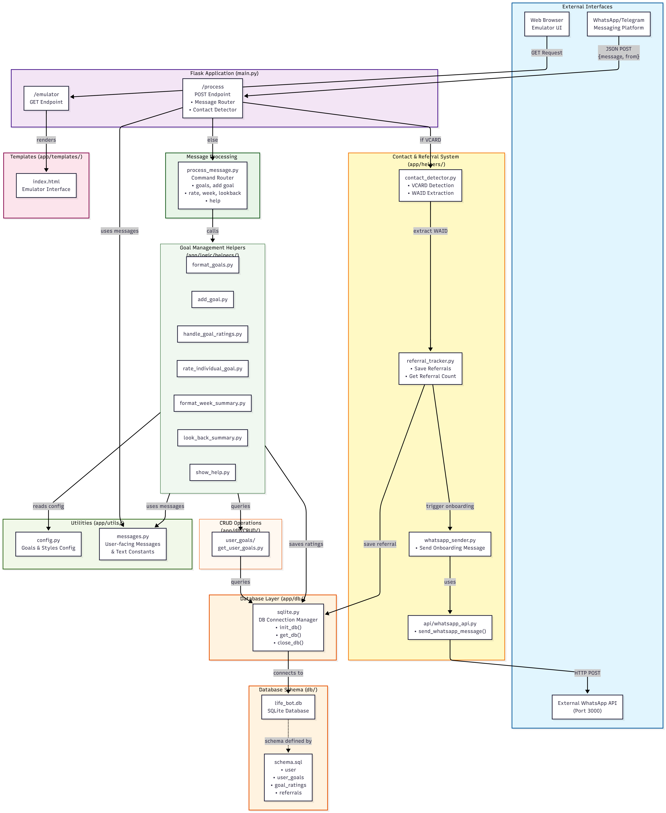

# Life Bot Backend Documentation

> **Framework:** Python, Flask
<!-- > **Docs generated for Material for MkDocs** -->

---

## Table of Contents
- [Overview](#overview)
- [Architecture](#architecture)
- [Setup & Dependencies](#setup--dependencies)
- [API Endpoints](#api-endpoints)
- [Message Commands & Logic](#message-commands--logic)
- [Database Schema](#database-schema)
- [Directory Structure](#directory-structure)
- [Running](#running)

---

## Overview

This repository contains the backend for Life Bot, a messaging-based goal and habit tracker. Users interact with Life Bot via chat commands to add goals, rate their performance, and get summaries. The backend is implemented with Flask, uses a SQLite database, and exposes a `/process` endpoint for chat platforms (e.g., WhatsApp, Telegram) plus a `/emulator` route for a web-based emulator UI.

---

## Architecture

- **Python 3.11+**
- **Flask** for the web/API interface
- **SQLite** for persistent storage
- **Modular logic**: commands are routed to helpers for clarity and maintainability
- **Material for MkDocs**: used for this documentation



---

## Setup & Dependencies

Use `uv` to manage the environment and dependencies. No manual virtualenv activation is required.

1) From the `backend` directory, install and sync dependencies from `pyproject.toml`/`uv.lock`:
```sh
cd backend
uv sync
```

Main dependencies:
- `flask`
- `pytest` (for testing)

---

## API Endpoints

### POST `/process`
- Processes chat messages delivered as JSON payloads.
- **Request JSON Structure:**
  ```json
  {
    "message": "<user message>",
    "from": "+1234567890"
  }
  ```
- **Response:**
  - String message (bot reply)

### GET `/emulator`
- Serves a web-based emulator UI (`index.html` in `templates/`).
- Used for developer testing without real chat platforms.

---

## Message Commands & Logic

Commands are routed via `process_message(message, sender)` in the backend.

| Command        | Description                                    | Example                    |
|:-------------- |:-----------------------------------------------|:---------------------------|
| `help`         | Show all commands / usage help                  | help                       |
| `goals`        | List your personal goals                        | goals                      |
| `add goal ...` | Add a new goal (with emoji/desc)                | add goal 🏃 Run daily       |
| `week`         | Show a summary for the current week             | week                       |
| `lookback [n]` | Show the last n days summary (default 7)        | lookback 5                 |
| `rate x y`     | Rate goal x with y (1=fail,2=partial,3=success) | rate 2 3                   |
| `[digits]`     | Rate all goals at once                          | 123                        |

Examples:
```text
add goal 🏃 Exercise daily
rate 1 3   # rate first goal as success
lookback 3 # show last 3 days
```

### Command Routing
- All major commands are processed in `process_message.py` with clear docstring for each.
- Error-checking and validation included for each message branch.

---

## Database Schema

Managed by SQLite (see `backend/db/schema.sql`). Auto-setup via `init_db()`.

```sql
CREATE TABLE IF NOT EXISTS user (
    id INTEGER PRIMARY KEY AUTOINCREMENT,
    name TEXT NULL,
    phone TEXT UNIQUE NOT NULL,
    created_at DATETIME DEFAULT CURRENT_TIMESTAMP
);
CREATE TABLE IF NOT EXISTS user_goals (
    id INTEGER PRIMARY KEY AUTOINCREMENT,
    user_id INTEGER,
    goal_emoji TEXT NOT NULL,
    goal_description TEXT NOT NULL,
    is_active BOOLEAN DEFAULT 1,
    created_at DATETIME DEFAULT CURRENT_TIMESTAMP,
    FOREIGN KEY (user_id) REFERENCES user (id)
);
CREATE TABLE IF NOT EXISTS goal_ratings (
    id INTEGER PRIMARY KEY AUTOINCREMENT,
    user_goal_id INTEGER NOT NULL,
    rating INTEGER NOT NULL CHECK (rating >= 1 AND rating <= 3),
    date TEXT NOT NULL,
    created_at DATETIME DEFAULT CURRENT_TIMESTAMP,
    FOREIGN KEY (user_goal_id) REFERENCES user_goals (id)
);
```

---

## Directory Structure

```text
backend/
  ├── app/
  │   ├── db/                # Database connection/init/CRUD
  │   ├── logic/             # Main bot logic & helpers
  │   ├── routes/            # Flask blueprints and routes
  │   ├── templates/         # Web UI (emulator)
  │   └── utils/             # Config, constants
  ├── db/                    # SQLite file and schema
  ├── main.py                # Flask entrypoint
  └── tests/                 # Pytest-based unit/integration tests
```

---

## Running

Run the app directly with `uv`:
```sh
uv run main.py
```
- The server runs at `http://localhost:5000`.
- Emulator UI: open `http://localhost:5000/emulator`.

To stop the server: press `Ctrl+C` in the terminal.

For production, run the same command under a process manager like `systemd` (we use `systemd`).

---

## References & Useful Links
- [Flask Documentation](https://flask.palletsprojects.com/)
- [MkDocs Material](https://squidfunk.github.io/mkdocs-material/)
- [Python 3.11+](https://www.python.org/downloads/)