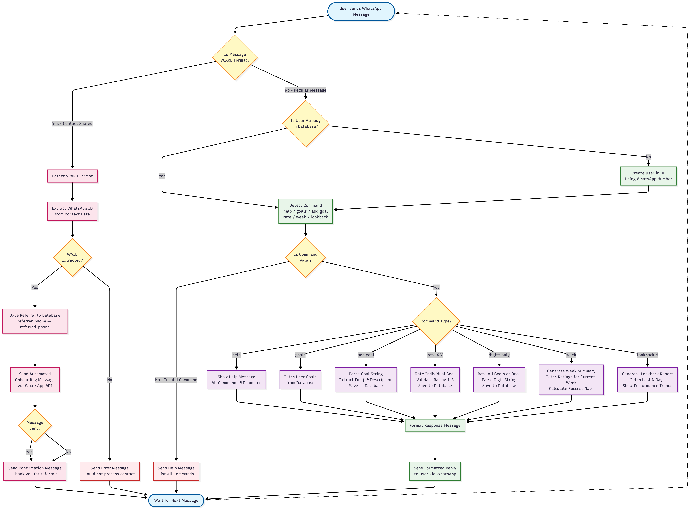

# Life Bot User Journey

> **Scope:** From WhatsApp message to backend response

---

## Diagram

---

## High-level Flow

- **User sends a WhatsApp message** to the bot.
- **WhatsApp client** (`whatsapp-client/index.js`) receives the message and forwards it to the backend `/process` endpoint.
- **Flask backend** (`backend/main.py`) routes the request to `process_message(message, sender)`.
- **Message router** (`backend/app/logic/process_message.py`) detects the intended command and dispatches to the appropriate helper.
- **Helpers & DB** perform reads/writes in SQLite (via `app/db/sqlite.py` and CRUD modules).
- **Backend returns a formatted reply**, and the WhatsApp client relays it back to the user.
- **Conversation continues** with the next incoming message.

---

## Decision Points and Steps

- **Is user already in database?**
  - Checked when accessing goals or storing ratings.
  - If not found, a user record is created using the WhatsApp number or chat ID.
  - Files:
    - `app/db/CRUD/user_goals/get_user_goals.py`
    - `app/db/sqlite.py`

- **Detect command** (message parsing and routing)
  - Supported triggers in `process_message.py`:
    - `help`
    - `goals`
    - `add goal <emoji> <description>`
    - `rate <goal-number> <rating-1-3>`
    - `[digits like 123]` (rate all goals for today)
    - `week`
    - `lookback [n]`
  - File: `app/logic/process_message.py`

- **Is command valid?**
  - Invalid or unknown commands result in a help message or a usage hint.
  - Example responses:
    - "❌ Unrecognized message. Type 'help' to see available commands."
    - "❌ Usage: add goal 😴 Sleep by 9pm"

- **Execute command logic**
  - `goals`: `helpers/format_goals.py`
  - `add goal`: `helpers/add_goal.py`
  - `rate <n> <r>`: `helpers/rate_individual_goal.py`
  - `123...`: `helpers/handle_goal_ratings.py`
  - `week`: `helpers/format_week_summary.py`
  - `lookback [n]`: `helpers/look_back_summary.py`
  - Shared utilities: `app/utils/config.py` (icons/styles)
  - DB access: `app/db/sqlite.py`

- **Send formatted reply**
  - Helpers return plain-text responses (often wrapped with code blocks for alignment).
  - WhatsApp client posts that reply back to the originating chat.

- **Wait for next message**
  - The loop continues per user’s ongoing interaction.

---

## WhatsApp Client Responsibilities

- Subscribe to `message` events
- POST the message payload to the backend:
  - Body: `{ message: msg.body, from: msg.from }`
- Handle QR login on first run; persist session with `LocalAuth`
- On errors (network/backend), log and fail gracefully

File: `whatsapp-client/index.js`

---

## Backend Components (Reference)

- `backend/main.py`: Flask entrypoint and routes (`/process`, `/emulator`)
- `app/logic/process_message.py`: Command routing
- `app/logic/helpers/*`: Command implementations
- `app/db/sqlite.py`: DB connection/init
- `backend/db/schema.sql`: Schema definition

---

## Typical User Scenarios

- **New user says "goals"**
  - User record is created (if absent)
  - Empty goals list is returned or initial guidance is shown

- **User adds a goal**
  - `add goal 🏃 Exercise daily` creates an active goal with emoji and description

- **User rates the day**
  - `312` stores ratings for the three goals for today
  - `rate 2 3` updates a specific goal’s rating

- **User requests summaries**
  - `week` returns current week header and daily statuses
  - `lookback 5` returns the last 5 days summary

---

## Notes

- Error and validation messages guide users toward correct usage
- All data persists in SQLite; deleting `life_bot.db` resets state
