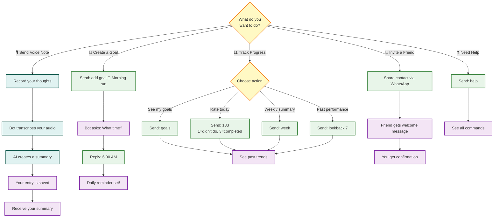

# User Flow

```mermaid
flowchart TB
    %% Removed Start and Done
    
    What{What do you<br/>want to do?}
    
    %% Voice Journaling
    %% (Start → What removed)
    %% (GetSummary → Done removed)
    
    %% Voice Journaling
    What -->|🎙️ Send Voice Note| Voice[Record your thoughts]
    Voice --> Transcribe[Bot transcribes your audio]
    Transcribe --> Summarize[AI creates a summary]
    Summarize --> SaveJournal[Your entry is saved]
    SaveJournal --> GetSummary[Receive your summary]
    
    %% Add Goal
    What -->|🎯 Create a Goal| AddGoal[Send: add goal 🏃 Morning run]
    AddGoal --> AskTime[Bot asks: What time?]
    AskTime --> SendTime[Reply: 6:30 AM]
    SendTime --> Confirmed[Daily reminder set!]
    
    %% View/Track Goals
    What -->|📊 Track Progress| Commands{Choose action}
    Commands -->|See my goals| ShowGoals[Send: goals]
    Commands -->|Rate today| RateGoals[Send: 133<br/>1=didn't do, 3=completed]
    Commands -->|Weekly summary| WeekView[Send: week]
    Commands -->|Past performance| LookBack[Send: lookback 7]

    ShowGoals --> GetInfo[See your goal list]
    RateGoals --> GetInfo[Progress recorded]
    WeekView --> GetInfo[See weekly stats]
    LookBack --> GetInfo[See past trends]
    
    %% Share
    What -->|👥 Invite a Friend| Share[Share contact via WhatsApp]
    Share --> Welcome[Friend gets welcome message]
    Welcome --> ThankYou[You get confirmation]
    
    %% Help
    What -->|❓ Need Help| Help[Send: help]
    Help --> ShowCommands[See all commands]
    
    %% No Done node anymore
    
    %% Styling (startEnd removed)
    classDef decision fill:#fff9c4,stroke:#f57f17,stroke-width:2px
    classDef action fill:#e8f5e9,stroke:#2e7d32,stroke-width:2px
    classDef result fill:#f3e5f5,stroke:#7b1fa2,stroke-width:2px
    classDef voice fill:#e0f2f1,stroke:#004d40,stroke-width:2px
    
    class What,Commands decision
    class AddGoal,SendTime,ShowGoals,RateGoals,WeekView,LookBack,Share,Help action
    class Voice,Transcribe,Summarize voice
    class SaveJournal,GetSummary,AskTime,Confirmed,GetInfo,Welcome,ThankYou,ShowCommands result
```
