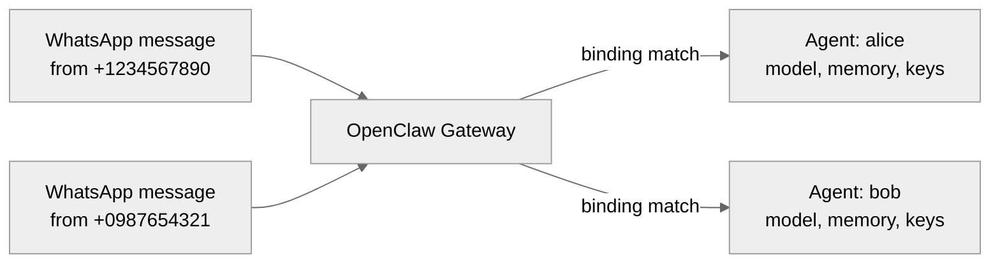

LogLife supports multiple users on a single OpenClaw instance. Each user gets their own **agent**, which means fully isolated conversation history, long-term memory, API keys, model selection, and usage tracking.

## How it works

The multi-user system maps each user to their own OpenClaw agent. When a message arrives, the gateway uses **bindings** to route it to the correct agent based on the sender's channel and peer ID. **Allow-lists** control who can message the bot on each channel.

All of this is achieved through configuration — no OpenClaw source modifications are needed.

## What each user gets

| Capability | Description |
|---|---|
| Separate conversation history | Each agent stores transcripts independently |
| Isolated long-term memory | Each agent has its own vector database (`memory/<agentId>.sqlite`) |
| Per-user API keys | Each agent can have its own provider credentials |
| Per-user model | Alice can use Claude while Bob uses GPT-4o |
| Per-user skills | Different tools and capabilities per user |
| Usage tracking | The gateway's `byAgent` API gives per-user breakdowns |
| Cross-channel identity | Multiple identifiers (WhatsApp, Telegram) route to the same agent |

## Generated configuration

The multi-user system produces a `generated.json` file that is included in `openclaw.json` via the `$include` directive. This file contains:

- **`agents.list`** — one agent definition per user (ID, name, model, skills)
- **`bindings`** — routing rules mapping `{channel, peerId}` to an agent
- **`channels`** — per-channel allow-lists and DM policies
- **`session`** — session scoping settings
- **`env`** — shared environment variables (API keys used by all users)

## Session scoping

The default session scope is `main`, which gives each agent one continuous conversation regardless of which channel the user messages from. This is the correct setting for journaling — your journal is your journal, whether you write from WhatsApp or Telegram.

Other OpenClaw session scopes are available but less useful with the multi-user layer:

| `dmScope` | Behavior with multi-user |
|---|---|
| `main` | One session per agent. All channels unified. **(default)** |
| `per-peer` | Separate sessions per peer ID. Fragments cross-channel identity. |
| `per-channel-peer` | Separate sessions per channel. Most fragmented. |

Since each agent only has one user, the agent boundary already provides complete isolation between users. The `dmScope` setting only affects behavior within each agent.

## Runtime user registration

New users are added at runtime through the [`/loglife/register`](/api-reference/endpoint/register) endpoint. The registration flow:

1. The plugin reads `users.json` (the source of truth for all users)
2. Appends the new user with their phone number as an identifier
3. Calls `generateConfig()` to rebuild `generated.json`
4. Writes the updated config
5. Touches `openclaw.json` to trigger a gateway hot-reload

The gateway picks up the new agent, binding, and allow-list entry immediately — **no restart required**.

<Info>
  The full rebuild approach regenerates `generated.json` from scratch on every registration. This is fast enough for the foreseeable scale — under 50ms at 1,000 users, about 1-2 seconds at 100,000 users.
</Info>

## Memory isolation

OpenClaw has six layers of persistent state. Five of them are fully isolated per agent (and therefore per user):

| Layer | Location | Isolated? |
|---|---|---|
| Conversation history | `~/.openclaw/agents/{agentId}/sessions/*.jsonl` | Yes |
| Session metadata | `~/.openclaw/agents/{agentId}/sessions/sessions.json` | Yes |
| Long-term memory | `~/.openclaw/memory/{agentId}.sqlite` | Yes |
| Workspace files | `~/.openclaw/workspace-{agentId}/` | Yes |
| Auth profiles | `~/.openclaw/agents/{agentId}/agent/auth-profiles.json` | Yes |
| Debug/trace logs | `~/.openclaw/logs/*.jsonl` | **No** (shared, operational only) |

The only shared layer is debug logs, which are operational data that no agent reads to inform its responses. For anything that affects what the bot says, remembers, or knows, the isolation is complete.

## Per-user API keys

By default, all users share API keys configured in `shared.env` within `users.json`. When a user needs their own keys (for separate billing, rate limits, or scoped services), their `env` field in `users.json` is populated and `writeAuthProfiles()` writes per-agent credentials to `~/.openclaw/agents/<agentId>/agent/auth-profiles.json`.

API keys can be stored as [1Password](https://1password.com/) references (`op://` URIs) instead of raw values. These are resolved at config generation time via the `op read` CLI.

## File structure

The multi-user code lives inside the plugin at `plugin/multi-user/`:

| File | Purpose |
|---|---|
| `types.ts` | Type definitions (`UsersConfig`, `UserProfile`, `ParsedIdentifier`) |
| `identifiers.ts` | Parses phone numbers and channel handles into `{channel, peerId}` |
| `generate.ts` | Produces the OpenClaw config fragment from `users.json` |
| `auth-setup.ts` | Writes per-user API keys to agent auth profiles |
| `usage.ts` | Maps gateway usage data to user profiles |
| `users.example.json` | Template for `users.json` |
