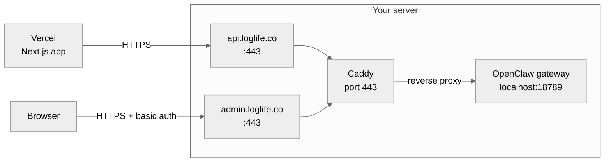

In development, the OpenClaw gateway listens on `localhost:18789` and the website connects to it directly. In production, you need HTTPS and proper domain names. This guide sets up [Caddy](https://caddyserver.com) as a reverse proxy with automatic SSL certificates.

## Architecture



Both domains proxy to the same OpenClaw gateway on `localhost:18789`. The gateway serves the LogLife plugin API (`/loglife/*`) and the OpenClaw Control UI (`/__openclaw__/`) on the same port. Caddy handles SSL, domain routing, and access control.

### Why a reverse proxy?

- **HTTPS**: Without it, API keys and gateway tokens travel in plain text. Caddy gets free SSL certificates from Let's Encrypt automatically.
- **Access control**: The API domain is open (protected by Bearer token). The admin domain adds HTTP basic auth so the Control UI is not publicly accessible.
- **Clean URLs**: Users and Vercel connect to `https://api.loglife.co` instead of `http://123.45.67.89:18789`.
- **Port isolation**: Port 18789 stays closed to the public. Only Caddy reaches it internally.

## DNS setup

Add two A records in your DNS provider (e.g. GoDaddy, Cloudflare) pointing to your server's IP:

| Type | Name | Value | TTL |
|------|------|-------|-----|
| A | `api` | Your server IP | 600 |
| A | `admin` | Your server IP | 600 |

Both records point to the same IP. Caddy differentiates them by domain name.

<Info>
  DNS changes can take up to an hour to propagate, but typically complete in under 5 minutes.
</Info>

## Caddy setup

### Install Caddy

```bash
sudo apt install -y debian-keyring debian-archive-keyring apt-transport-https curl
curl -1sLf 'https://dl.cloudsmith.io/public/caddy/stable/gpg.key' \
  | sudo gpg --dearmor -o /usr/share/keyrings/caddy-stable-archive-keyring.gpg
curl -1sLf 'https://dl.cloudsmith.io/public/caddy/stable/debian.deb.txt' \
  | sudo tee /etc/apt/sources.list.d/caddy-stable.list
sudo apt update
sudo apt install caddy
```

### Generate a password hash

Pick a username and password for the Control UI. Caddy uses bcrypt hashes:

```bash
caddy hash-password --plaintext 'your-password-here'
```

Copy the output (starts with `$2a$14$...`).

### Configure Caddy

Edit `/etc/caddy/Caddyfile`:

```text
api.loglife.co {
    reverse_proxy localhost:18789
}

admin.loglife.co {
    basicauth {
        admin $2a$14$PASTE_YOUR_HASH_HERE
    }
    reverse_proxy localhost:18789
}
```

Replace `admin` with your chosen username and paste the hash from the previous step.

### Start Caddy

```bash
sudo systemctl restart caddy
sudo systemctl enable caddy
```

Caddy automatically obtains SSL certificates. No additional configuration needed.

### Firewall

Open ports 80 and 443, and close direct access to the gateway port:

```bash
sudo ufw allow 80/tcp     # Let's Encrypt ACME challenge
sudo ufw allow 443/tcp    # HTTPS
sudo ufw delete allow 18789/tcp  # close direct access
```

<Warning>
  **Hetzner Cloud users**: Hetzner has its own firewall layer that runs *above* `ufw`. Even if `ufw` allows a port, Hetzner's firewall can still block it. Go to the [Hetzner Cloud Console](https://console.hetzner.cloud) > your project > **Firewalls** and add inbound rules for **TCP 80** and **TCP 443** from `0.0.0.0/0` and `::/0`. Without this, Caddy cannot complete the ACME challenge and SSL certificates will fail with "Timeout during connect (likely firewall problem)".
</Warning>

<Info>
  Other cloud providers (AWS, GCP, DigitalOcean, etc.) have similar external firewalls — security groups, VPC firewall rules, or cloud firewalls. Always check both the OS-level firewall (`ufw`, `iptables`) and the cloud provider's firewall when ports appear closed.
</Info>

### Verify

```bash
# API endpoint (should return 404 — "Session not found")
curl -H "Authorization: Bearer YOUR_API_KEY" \
  "https://api.loglife.co/loglife/sessions?phone=healthcheck"

# Admin UI (should prompt for username/password in browser)
curl -I "https://admin.loglife.co/__openclaw__/"
# Expected: 401 Unauthorized (basic auth required)
```

## Update Vercel

After Caddy is running, update the `OPENCLAW_API_URL` in your Vercel project settings:

| Variable | Old value | New value |
|----------|-----------|-----------|
| `OPENCLAW_API_URL` | `http://SERVER_IP:18789` | `https://api.loglife.co` |

The `OPENCLAW_API_KEY` stays the same.

## Troubleshooting

### DNS

<AccordionGroup>

<Accordion title="Domain doesn't resolve to my server IP">
  Check your DNS records:

  ```bash
  dig api.loglife.co +short
  dig admin.loglife.co +short
  ```

  Both should return your server's IP. If not, verify the A records in your DNS provider (GoDaddy, Cloudflare, etc.). DNS changes can take up to an hour to propagate — wait and retry.
</Accordion>

<Accordion title="DNS resolves but browser shows 'connection refused'">
  DNS is fine, but the server isn't accepting connections. Check that Caddy is running and ports are open:

  ```bash
  sudo systemctl status caddy
  sudo ss -tlnp | grep -E ':80|:443'
  ```

  If nothing is listening on 80/443, restart Caddy: `sudo systemctl restart caddy`.
</Accordion>

</AccordionGroup>

### SSL certificates

<AccordionGroup>

<Accordion title="Caddy fails with 'Timeout during connect (likely firewall problem)'">
  This means Let's Encrypt cannot reach your server on port 80 or 443 to verify domain ownership. Most common causes:

  1. **Cloud provider firewall** (Hetzner, AWS, GCP, etc.) is blocking inbound traffic — see the warning above about Hetzner Cloud Firewalls.
  2. **OS firewall** (`ufw` or `iptables`) is blocking port 80. Check with `sudo ufw status` or `sudo iptables -L -n`.
  3. **Another service** is already using port 80 (e.g. Apache). Check with `sudo ss -tlnp | grep :80`.

  After fixing the firewall, restart Caddy so it retries:

  ```bash
  sudo systemctl restart caddy
  sleep 15
  sudo journalctl -u caddy --no-pager -n 10
  ```

  Look for "certificate obtained successfully" in the logs.
</Accordion>

<Accordion title="SSL error when curling from the server itself">
  If `curl https://api.loglife.co` fails with an SSL error from the server, it may be because the certificate hasn't been issued yet. Check Caddy logs:

  ```bash
  sudo journalctl -u caddy --no-pager -n 20
  ```

  If certificates are still being obtained, wait a moment and retry. Caddy will retry automatically on failure.
</Accordion>

</AccordionGroup>

### Reverse proxy

<AccordionGroup>

<Accordion title="502 Bad Gateway from Caddy">
  The OpenClaw gateway is not running. Start it:

  ```bash
  cd ~/openclaw
  ./openclaw.mjs gateway start
  ```

  Verify it's listening:

  ```bash
  curl http://localhost:18789
  ```
</Accordion>

<Accordion title="401 Unauthorized from the API">
  The Bearer token doesn't match. Check that the key in Vercel matches the key in OpenClaw's config:

  ```bash
  grep apiKey ~/.openclaw/openclaw.json
  ```

  Update whichever side is out of sync. If you regenerated the key, update both Vercel and GitHub secrets.
</Accordion>

<Accordion title="Can't access admin.loglife.co after basic auth">
  The OpenClaw gateway may also require its own authentication token. You'll see the basic auth prompt from Caddy first, then the gateway may require its own credentials. Check your gateway config:

  ```bash
  grep -A2 '"auth"' ~/.openclaw/openclaw.json
  ```

  The gateway token is separate from the Caddy basic auth password and from the LogLife API key.
</Accordion>

<Accordion title="API works locally but not from Vercel">
  The issue is between Vercel's servers and your server. Check step by step:

  ```bash
  # 1. Verify DNS resolves correctly
  dig api.loglife.co +short

  # 2. Verify HTTPS works externally
  curl -I https://api.loglife.co

  # 3. Verify the plugin responds
  curl -H "Authorization: Bearer YOUR_KEY" \
    "https://api.loglife.co/loglife/sessions?phone=test"
  ```

  If step 2 times out, ports 80/443 are blocked at the cloud provider level. If step 3 returns 401, the API key is wrong.
</Accordion>

</AccordionGroup>
