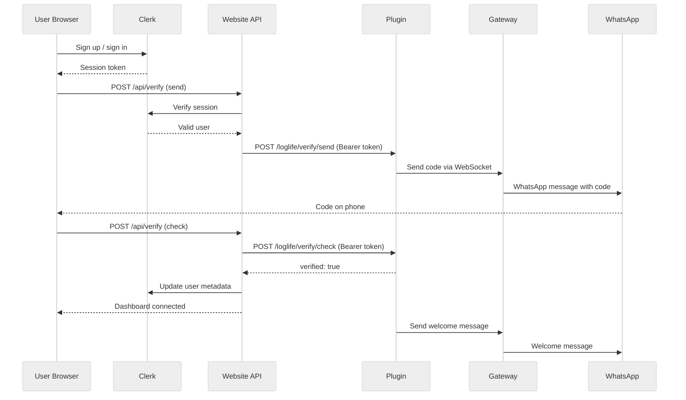

## Design principles

LogLife follows a **server-initiated contact** model. Users must sign up through the website and verify their phone number before LogLife ever sends them a message. This is a deliberate architectural choice.

### Why "we message first"

| Concern | Open inbound (anyone texts us) | Server-initiated (we text first) |
|---|---|---|
| Identity | Unknown — anyone with the number can text | Known — tied to a Clerk account |
| API cost exposure | Unbounded — each message triggers LLM calls | Bounded — only verified users generate cost |
| Abuse surface | Wide — spam, prompt injection from strangers | Narrow — only authenticated users interact |
| Kill switch | Block phone numbers manually | Disable Clerk account, stop responding |
| Rate limiting | Hard — no user identity to rate-limit against | Easy — per-user, per-account limits |

By requiring signup and phone verification, every interaction is tied to a known user. If someone abuses the system, their account can be disabled instantly.

### Referrals instead of open access

Instead of letting anyone message LogLife directly, new users are onboarded through:

1. **Direct signup** at loglife.co/signup
2. **Referral links** shared by existing users

Both paths go through Clerk authentication and phone verification before any messages are exchanged. This keeps the funnel controlled and auditable.

## Authentication

### Website to plugin

All communication between the Next.js website (hosted on Vercel) and the OpenClaw plugin is authenticated with a **Bearer token**. The token is set as `OPENCLAW_API_KEY` on both sides.

- The website's API routes (`/api/sessions`, `/api/verify`) add the token to every request to the plugin.
- The plugin validates the token using `crypto.timingSafeEqual` to prevent timing attacks.
- Requests without a valid token receive a `401 Unauthorized` response.

### User authentication

User authentication is handled by **Clerk**. The website's API routes verify that the caller has a valid Clerk session before proxying to the plugin. This means:

- An unauthenticated browser request to `/api/verify` is rejected before it ever reaches the plugin.
- The plugin itself does not need to know about individual users — it trusts the website's Bearer token.

## Phone verification

Phone ownership is proven through a **6-digit verification code** sent via WhatsApp:

1. User enters their phone number on the dashboard.
2. The plugin generates a code using `crypto.randomInt` (cryptographically secure).
3. The code is sent to the phone via the OpenClaw gateway.
4. The user enters the code on the dashboard.
5. The plugin compares it using `crypto.timingSafeEqual`.

### Protections

- **5-minute TTL**: Codes expire after 5 minutes. Expired codes are rejected.
- **Single use**: A code is deleted immediately after successful verification. It cannot be reused.
- **Rate limiting**: Only one code can be sent per phone number per 60 seconds. Repeated requests return `429 Too Many Requests`.
- **Timing-safe comparison**: Code comparison uses constant-time equality to prevent timing side-channel attacks.

## Rate limits

### Current limits

| Resource | Limit | Window |
|---|---|---|
| Verification code sends | 1 per phone | 60 seconds |
| Verification code validity | 1 code | 5 minutes |

### Planned limits

As LogLife scales, additional guardrails will be added:

- **Message rate limits** — maximum messages per user per day
- **Audio processing limits** — maximum audio messages and duration per day
- **Token budgets** — per-user token consumption caps per billing period
- **Usage dashboard** — visible on the dashboard so users can monitor their own consumption

## Data flow

## Infrastructure security

- **No secrets in code**: API keys, Clerk keys, and SSH keys are stored in GitHub Actions secrets and Vercel environment variables. Never committed to the repository.
- **SSH deployment**: Plugin deployment uses SSH key authentication. No passwords are transmitted.
- **Health checks**: Every deployment verifies the plugin is responding correctly before marking the deploy as successful.
- **Sessions persisted to disk**: Session data survives gateway restarts. No data loss during deployments.
- **In-memory verification codes**: Codes are intentionally not persisted. A gateway restart clears all pending codes, which is acceptable given their 5-minute TTL.
