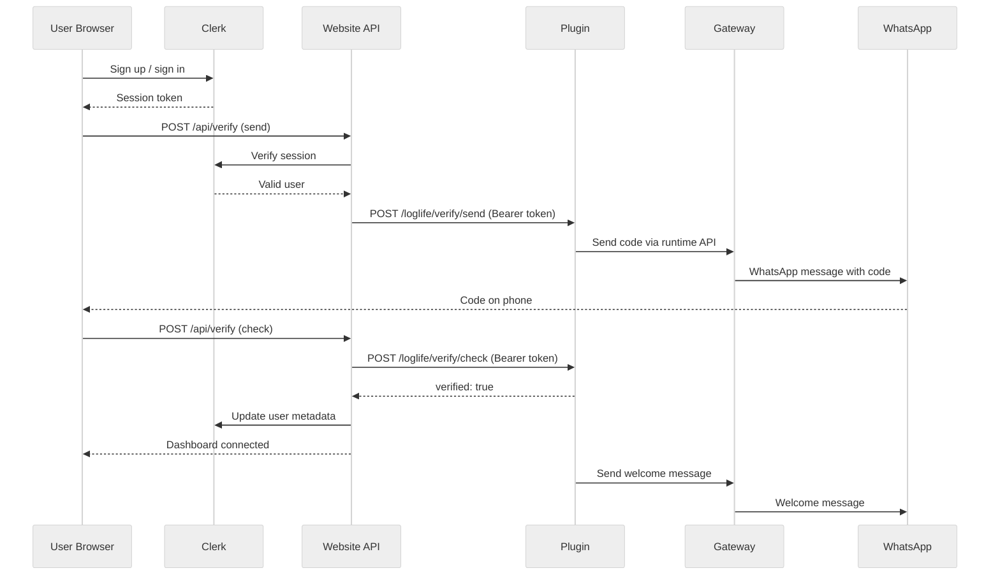

## Design principles

LogLife follows a **server-initiated contact** model. Users must sign up through the website and verify their phone number before LogLife ever sends them a message. This is a deliberate architectural choice.

### Why "we message first"

| Concern | Open inbound (anyone texts us) | Server-initiated (we text first) |
|---|---|---|
| Identity | Unknown — anyone with the number can text | Known — tied to a Clerk account |
| API cost exposure | Unbounded — each message triggers LLM calls | Bounded — only verified users generate cost |
| Abuse surface | Wide — spam, prompt injection from strangers | Narrow — only authenticated users interact |
| Kill switch | Block phone numbers manually | Disable Clerk account, stop responding |
| Rate limiting | Hard — no user identity to rate-limit against | Easy — per-user, per-account limits |

By requiring signup and phone verification, every interaction is tied to a known user. If someone abuses the system, their account can be disabled instantly.

### Referrals instead of open access

Instead of letting anyone message LogLife directly, new users are onboarded through:

1. **Direct signup** at loglife.co/signup
2. **Referral links** shared by existing users

Both paths go through Clerk authentication and phone verification before any messages are exchanged. This keeps the funnel controlled and auditable.

## Authentication

### Website to plugin

All communication between the Next.js website (hosted on Vercel) and the OpenClaw plugin is authenticated with a **Bearer token**. The token is set as `OPENCLAW_API_KEY` on both sides.

- The website's API routes (`/api/sessions`, `/api/verify`) add the token to every request to the plugin.
- The plugin validates the token using `crypto.timingSafeEqual` to prevent timing attacks.
- Requests without a valid token receive a `401 Unauthorized` response.

### User authentication

User authentication is handled by **Clerk**. The website's API routes verify that the caller has a valid Clerk session before proxying to the plugin. This means:

- An unauthenticated browser request to `/api/verify` is rejected before it ever reaches the plugin.
- The plugin itself does not need to know about individual users — it trusts the website's Bearer token.

## WhatsApp linking security model (current V2 flow)

Phone ownership is proven through a **user-initiated WhatsApp message** containing an `LF-XXXX` code.

1. User enters phone on the dashboard.
2. Backend registers the phone and generates a short-lived link code.
3. User taps a prefilled WhatsApp button and sends the code from that phone.
4. Plugin auto-verifies, marks link complete, and sends a welcome message.

### Expiry and cleanup behavior

- **TTL**: Pending link codes expire after 5 minutes.
- **Sweep interval**: Expired pending links are cleaned every 30 seconds.
- **Effective removal window**: cleanup usually happens between `5:00` and `5:30` after link creation (or earlier if message-count guardrails trigger).
- **Persistence across restarts**: pending links are stored in `multi-user/pending-links.json`, so a restart does not silently drop pending-link cleanup state.
- **Wrong-number rollback scope**: only users created during the current register flow are auto-removed on expiry; pre-existing users are not auto-deleted.

## Rate limits

### Current limits

| Resource | Limit | Window |
|---|---|---|
| Verify/send code API (legacy flow) | 1 per phone | 60 seconds |
| Pending link validity (V2 flow) | 1 link | 5 minutes |

### Planned limits

As LogLife scales, additional guardrails will be added:

- **Message rate limits** — maximum messages per user per day
- **Audio processing limits** — maximum audio messages and duration per day
- **Token budgets** — per-user token consumption caps per billing period
- **Usage dashboard** — visible on the dashboard so users can monitor their own consumption

## Stage-by-stage attacks and mitigations

| Stage | Possible attacks | Current mitigation |
|---|---|---|
| Dashboard register request | Unauthenticated caller attempts registration; forged client requests | Clerk session required by website API route; plugin route protected by Bearer API key; timing-safe token compare |
| Phone entry and linking | User enters wrong number; script repeatedly requests links | 5-minute TTL; 30-second sweeper; pending-link message-count cap; existing-user path is idempotent |
| Pending (not verified yet) | Unverified sender tries to trigger agent replies by messaging random text/code-like payloads | Pending links are tracked per phone; linking messages are intercepted and canceled before normal agent reply path |
| Code replay / brute-force | Try old codes, random `LF-XXXX` payloads, or repeated guesses | Exact-code match required per phone; pending link expires quickly; wrong attempts increase counters and can trigger cleanup |
| Verified messaging | Abuse via high message volume or expensive prompts | Allow-list DM policy; account-level controls and disable path; planned per-user message/token budgets |
| Infra / operational | Gateway restart during linking; stale in-memory state | Pending-link state is persisted to disk and reloaded; cleanup continues after restart |

### Residual risk and intentional behavior

- Existing users are intentionally not auto-deleted when a fresh link attempt expires. This avoids deleting valid long-lived users during accidental re-link attempts.
- If you need stronger enforcement (for example, "must re-verify before any further messaging"), use a stricter reconnect mode that temporarily suspends allow-list access until verification completes.

## Data flow (legacy verification API)

```mermaid
%%{init: {'theme': 'neutral'}}%%
sequenceDiagram
    participant U as User Browser
    participant C as Clerk
    participant W as Website API
    participant P as Plugin
    participant G as Gateway
    participant WA as WhatsApp

    U->>C: Sign up / sign in
    C-->>U: Session token
    U->>W: POST /api/verify (send)
    W->>C: Verify session
    C-->>W: Valid user
    W->>P: POST /loglife/verify/send (Bearer token)
    P->>G: Send code via runtime API
    G->>WA: WhatsApp message with code
    WA-->>U: Code on phone
    U->>W: POST /api/verify (check)
    W->>P: POST /loglife/verify/check (Bearer token)
    P-->>W: verified: true
    W->>C: Update user metadata
    W-->>U: Dashboard connected
    P->>G: Send welcome message
    G->>WA: Welcome message
```

## Infrastructure security

- **No secrets in code**: API keys, Clerk keys, and SSH keys are stored in GitHub Actions secrets and Vercel environment variables. Never committed to the repository.
- **HTTPS everywhere**: A Caddy reverse proxy terminates SSL in front of the gateway. The gateway port (18789) is closed to the public — only Caddy reaches it locally. See the [Networking guide](/networking) for setup.
- **Layered auth on Control UI**: The OpenClaw Control UI is protected by HTTP basic auth (Caddy) in addition to the gateway's own authentication token. The API domain is open but protected by the Bearer token.
- **SSH deployment**: Plugin deployment uses SSH key authentication. No passwords are transmitted.
- **Health checks**: Every deployment verifies the plugin is responding correctly before marking the deploy as successful.
- **Sessions persisted to disk**: Session data survives gateway restarts. No data loss during deployments.
- **In-memory verification codes**: Codes are intentionally not persisted. A gateway restart clears all pending codes, which is acceptable given their 5-minute TTL.
