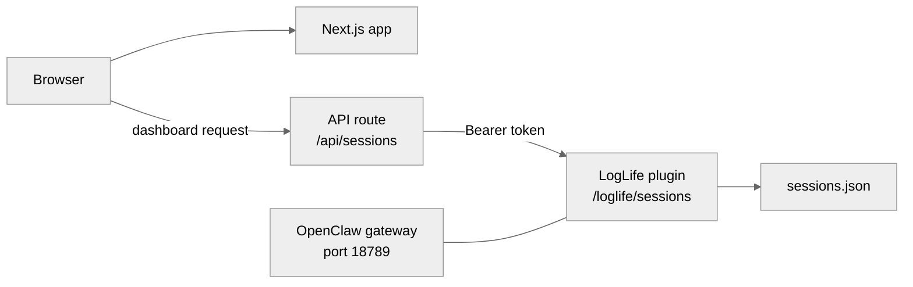

LogLife runs as two independent pieces: a **Next.js website** hosted on Vercel (marketing site + dashboard) and an **OpenClaw plugin** that serves session data from your server. The dashboard talks to the plugin through a secure API — your server address and key never reach the browser.

## Architecture

The website is a static marketing site for most visitors. When a logged-in user opens the dashboard, the Next.js API route proxies requests to the OpenClaw plugin. The plugin reads `sessions.json` and returns session data. Authentication uses a shared Bearer token — the key lives in your server's OpenClaw config and in Vercel's environment variables, never in client-side code.

## Get started

Follow these guides in order to go from zero to a running LogLife instance:

<Steps>

<Step title="Install the plugin">
  Clone the repos, build OpenClaw, install the LogLife plugin, and start the gateway.

  [Plugin installation guide →](/plugin-installation)
</Step>

<Step title="Configure everything">
  Set up environment variables, plugin config, and Vercel deployment settings.

  [Configuration guide →](/configuration)
</Step>

<Step title="Set up networking">
  Put Caddy in front of the gateway for HTTPS, DNS, and access control.

  [Networking guide →](/networking)
</Step>

</Steps>
