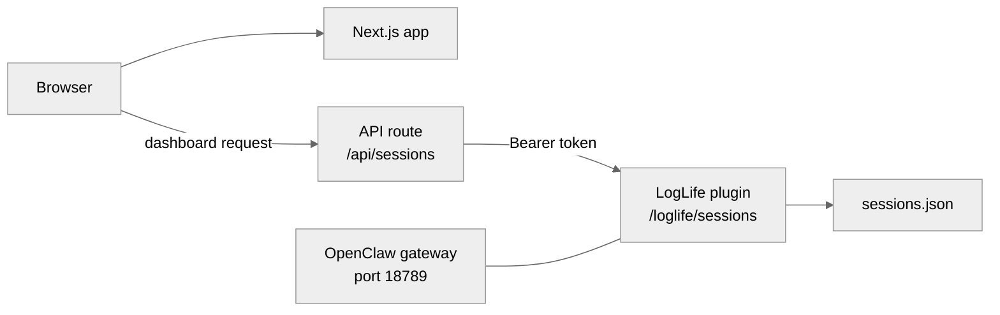

LogLife runs as two independent pieces: a **Next.js website** hosted on Vercel (marketing site + dashboard) and an **OpenClaw plugin** that serves session data from your server. The dashboard talks to the plugin through a secure API — your server address and key never reach the browser.

## Architecture



The website is a static marketing site for most visitors. When a logged-in user opens the dashboard, the Next.js API route proxies requests to the OpenClaw plugin. The plugin reads `sessions.json` and returns session data. Authentication uses a shared Bearer token — the key lives in your server's OpenClaw config and in Vercel's environment variables, never in client-side code.

## Prerequisites

<Info>
  **You need:**
  - [Node.js](https://nodejs.org) 24 or higher
  - [pnpm](https://pnpm.io) 10 or higher
  - [Git](https://git-scm.com)
</Info>

## Setup

<Steps>

<Step title="Clone both repositories">

```bash
git clone https://github.com/jmoraispk/loglife.git
git clone https://github.com/openclaw/openclaw.git ~/openclaw
```

</Step>

<Step title="Build OpenClaw">

```bash
cd ~/openclaw
pnpm install
pnpm build
```

This compiles the OpenClaw gateway and CLI tools you'll use in the next steps.

</Step>

<Step title="Install the LogLife plugin">

```bash
cd ~/openclaw
./openclaw.mjs plugins install /path/to/loglife/plugin --link
```

The `--link` flag means the plugin loads directly from your LogLife repo — no files are copied. When you `git pull` new changes, the plugin updates automatically.

</Step>

<Step title="Generate an API key">

```bash
cd ~/openclaw
./openclaw.mjs config set plugins.entries.loglife.config.apiKey "$(openssl rand -hex 32)"
```

This creates a random 256-bit key and stores it in `~/.openclaw/openclaw.json`. You'll need this key for the website in step 6.

To retrieve the key later:

```bash
grep apiKey ~/.openclaw/openclaw.json
```

</Step>

<Step title="Start the OpenClaw gateway">

<CodeGroup>

```bash Development (foreground)
cd ~/openclaw
./openclaw.mjs gateway --allow-unconfigured
```

```bash Production (background service)
cd ~/openclaw
./openclaw.mjs gateway install
./openclaw.mjs gateway start
```

</CodeGroup>

Verify the plugin loaded by hitting the endpoint:

```bash
curl -H "Authorization: Bearer YOUR_API_KEY" \
  "http://localhost:18789/loglife/sessions?sessionId=test"
```

You should get a JSON response — either session data or `{"error":"Session not found"}`. Both mean the plugin is working.

<Tip>If you already have an OpenClaw instance with sessions, try a real session ID to see actual data.</Tip>

</Step>

<Step title="Set up the website">

```bash
cd loglife/website
pnpm install
```

Create a `.env` file (or edit the existing one) with your OpenClaw connection:

```bash .env
OPENCLAW_API_URL=http://localhost:18789
OPENCLAW_API_KEY=<your key from step 4>
```

Start the dev server:

```bash
pnpm dev
```

Open `http://localhost:3000`. The dashboard will now fetch session data through the plugin.

</Step>

</Steps>

## Automated setup

If you prefer a single script instead of manual steps, the plugin includes a production setup script that handles steps 3–5 automatically:

```bash
bash ~/loglife/plugin/setup.sh
```

The script installs the plugin, generates an API key (if not already set), restarts the gateway, and runs a health check. It prints the API key and next steps at the end.

## Production deployment

### Networking

In production, you should put a reverse proxy (Caddy) in front of the gateway for HTTPS and access control. See the [Networking guide](/networking) for full setup instructions including DNS, SSL, and basic auth for the Control UI.

### Website (Vercel)

The website deploys to Vercel automatically on every push to `main`. Set these environment variables in your [Vercel project settings](https://vercel.com/docs/environment-variables):

| Variable | Value |
|---|---|
| `OPENCLAW_API_URL` | `https://api.yourdomain.com` (see [Networking](/networking)) |
| `OPENCLAW_API_KEY` | The key from step 4 above |

### Plugin (server)

A GitHub Actions workflow triggers on pushes to `main` that change files in `plugin/**`. The workflow SSHes into your server and runs `git pull` to update the plugin code. You need to configure GitHub Actions secrets and Vercel environment variables — see the [CI/CD section](/development#ci-cd) for the full list of required secrets.

## Plugin configuration

The plugin accepts two config values in `openclaw.json` under `plugins.entries.loglife.config`:

| Key | Required | Default | Description |
|---|---|---|---|
| `apiKey` | Yes | — | Shared secret for authenticating dashboard requests |
| `agentId` | No | `"main"` | Which agent's sessions to serve |

Set values with the OpenClaw CLI:

```bash
cd ~/openclaw
./openclaw.mjs config set plugins.entries.loglife.config.apiKey "your-key"
./openclaw.mjs config set plugins.entries.loglife.config.agentId "main"
```

## Troubleshooting

<AccordionGroup>

<Accordion title="Plugin install fails with 'plugin not found'">
  Make sure the `name` field in `plugin/package.json` matches the `id` in `plugin/openclaw.plugin.json`. Both should be `"loglife"`.
</Accordion>

<Accordion title="Dashboard shows 'Failed to reach OpenClaw server'">
  Check that the gateway is running and the `OPENCLAW_API_URL` in your `.env` is correct. Test the connection directly:

  ```bash
  curl -H "Authorization: Bearer YOUR_KEY" \
    "http://localhost:18789/loglife/sessions?sessionId=test"
  ```
</Accordion>

<Accordion title="Gateway fails to start with lock error">
  Another gateway process may already be running. Kill it and try again:

  ```bash
  pkill -f "openclaw gateway" && ./openclaw.mjs gateway --allow-unconfigured
  ```
</Accordion>

<Accordion title="401 Unauthorized from the plugin">
  The API key in your `.env` (or Vercel env vars) doesn't match the key in `~/.openclaw/openclaw.json`. Regenerate it and update both sides:

  ```bash
  cd ~/openclaw
  ./openclaw.mjs config set plugins.entries.loglife.config.apiKey "$(openssl rand -hex 32)"
  grep apiKey ~/.openclaw/openclaw.json
  ```
</Accordion>

</AccordionGroup>
