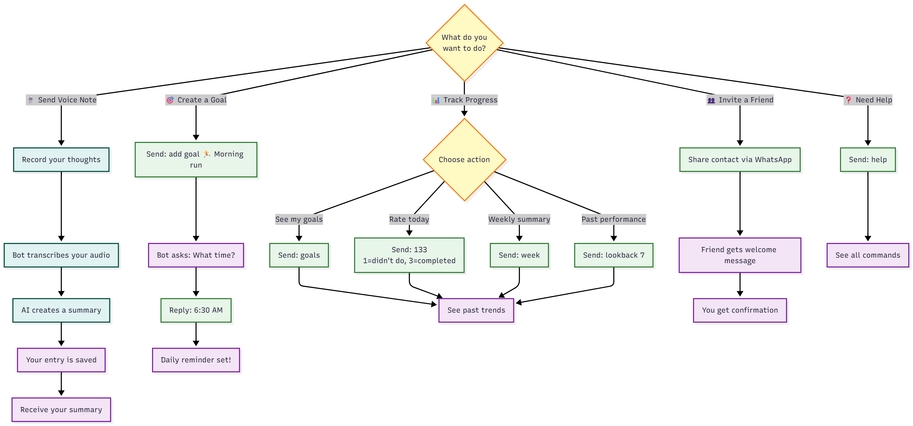

# 📘 User Guide

Welcome to LogLife! Your personal AI companion for tracking goals, journaling thoughts, and building better habits through simple conversations.

---

## 🗺️ How It Works

LogLife is designed to be intuitive. Just chat with the bot like you would with a friend.

<small>**Legend:** ⚠️ Decisions ✅ Actions 💜 Results 🎙️ Voice</small>

> _Tip: Click the image to enlarge._

---

## 🚀 Key Features

### 🎙️ [Audio Journaling](audio-journaling.md)
**Speak your mind.**
Send a voice note, and LogLife will transcribe it and generate a concise summary. Perfect for brain dumps, diary entries, or capturing ideas on the go.

### 🎯 [Goal Tracking](managing-goals.md)
**Stay on track.**
Define your daily goals (e.g., "Read 30 mins", "No Sugar"). LogLife will remind you to rate your progress every day, helping you build streaks and consistency.

### 🤝 [Referrals](referrals.md)
**Share the journey.**
Invite friends simply by sharing their contact card with the bot. They'll get an instant welcome message to start their own journey.

---

## 💡 Quick Tips

*   **Be Casual**: You don't need strict commands. Just say "add a goal to read more" or "here is a voice note".
*   **Set Reminders**: Tell the bot "remind me at 9pm" to set your daily check-in time.
*   **Check Progress**: Ask "how did I do this week?" to get a summary of your performance.
