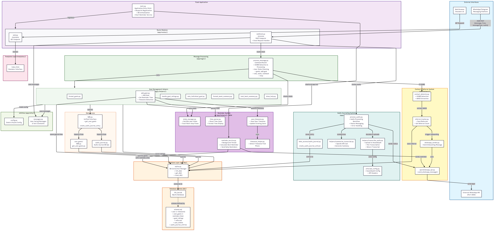

# Life Bot Backend Documentation

> **Framework:** Python, Flask
<!-- > **Docs generated for Material for MkDocs** -->

---

 


## Architecture

- **Python 3.11+**
- **Flask**
- **SQLite**



_Tip: Click the image to zoom._ 

---

## Setup & Dependencies

1) From the `backend` directory, install and sync dependencies from `pyproject.toml`/`uv.lock`:
```sh
cd backend
uv sync
```

Main dependencies:

- `flask`
- `python-dotenv`
- `requests`

Development dependencies (install with `uv sync --extra dev`):

- `pytest`

---

## API Endpoints

1. **POST `/process`**

    - Main webhook endpoint for processing incoming messages.
    - **Request Body:**
     ```json
     {
       "message": "<message content or VCARD data>",
       "from": "<sender phone number>"
     }
     ```
    - **Response:** Plain text string with the bot's reply.

2. **GET `/emulator`**

    - Serves a web-based testing interface.

---

## Message Commands & Logic

Commands are routed via `process_message(message, sender)` in the backend.

| Command        | Description                                    | Example                    |
|:-------------- |:-----------------------------------------------|:---------------------------|
| `help`         | Show all commands / usage help                  | help                       |
| `goals`        | List your personal goals                        | goals                      |
| `add goal ...` | Add a new goal (with emoji/desc)                | add goal 🏃 Run daily       |
| `week`         | Show a summary for the current week             | week                       |
| `lookback [n]` | Show the last n days summary (default 7)        | lookback 5                 |
| `rate x y`     | Rate goal x with y (1=fail,2=partial,3=success) | rate 2 3                   |
| `[digits]`     | Rate all goals at once                          | 123                        |

### Command Routing
- All major commands are processed in `process_message.py` with clear docstring for each.
- VCARD messages are auto-detected and routed to the referral flow.

---

## Referral System

Allows users to share LogLife Bot via WhatsApp contact sharing.

### Core Modules

| Module | Functions | Purpose |
|--------|-----------|---------|
| `contact_detector.py` | `is_vcard()`<br>`extract_waid_from_vcard()` | VCARD format detection<br>WhatsApp ID extraction |
| `referral_tracker.py` | `process_referral()`<br>`save_referral()`<br>`get_referral_count()` | Complete referral workflow<br>Database operations<br>Referral statistics |
| `whatsapp_sender.py` | `send_onboarding_msg()` | Automated onboarding messages |
| `api/whatsapp_api.py` | `send_whatsapp_message()` | WhatsApp API client |

### Configuration

**Environment Variable:**

- WhatsApp API base URL (default: `http://localhost:3000`)

**External Dependency:**

- WhatsApp client service must be running with `/send-message` endpoint

---

## Database Schema

### Tables Overview

| Table | Purpose | Key Fields |
|-------|---------|------------|
| `user` | User profiles | `phone` (unique), `name`, `created_at` |
| `user_goals` | Goal definitions | `user_id`, `goal_emoji`, `goal_description`, `is_active` |
| `goal_ratings` | Daily ratings | `user_goal_id`, `rating` (1-3), `date` |
| `referrals` | Referral tracking | `referrer_phone`, `referred_phone`, `referred_waid`, `status` |

<details>
<summary>Full Schema SQL</summary>

```sql
CREATE TABLE IF NOT EXISTS user (
    id INTEGER PRIMARY KEY AUTOINCREMENT,
    name TEXT NULL,
    phone TEXT UNIQUE NOT NULL,
    created_at DATETIME DEFAULT CURRENT_TIMESTAMP
);

CREATE TABLE IF NOT EXISTS user_goals (
    id INTEGER PRIMARY KEY AUTOINCREMENT,
    user_id INTEGER,
    goal_emoji TEXT NOT NULL,
    goal_description TEXT NOT NULL,
    is_active BOOLEAN DEFAULT 1,
    created_at DATETIME DEFAULT CURRENT_TIMESTAMP,
    FOREIGN KEY (user_id) REFERENCES user (id)
);

CREATE TABLE IF NOT EXISTS goal_ratings (
    id INTEGER PRIMARY KEY AUTOINCREMENT,
    user_goal_id INTEGER NOT NULL,
    rating INTEGER NOT NULL CHECK (rating >= 1 AND rating <= 3),
    date TEXT NOT NULL,
    created_at DATETIME DEFAULT CURRENT_TIMESTAMP,
    FOREIGN KEY (user_goal_id) REFERENCES user_goals (id)
);

CREATE TABLE IF NOT EXISTS referrals (
    id INTEGER PRIMARY KEY AUTOINCREMENT,
    referrer_phone TEXT NOT NULL,
    referred_phone TEXT NOT NULL,
    referred_waid TEXT NOT NULL,
    status TEXT DEFAULT 'pending',
    created_at DATETIME DEFAULT CURRENT_TIMESTAMP
);
```

</details>

---

## Directory Structure

```text
backend/
  ├── app/
  │   ├── db/                # Database connection/init/CRUD
  │   ├── helpers/           # Utility functions
  │   │   ├── api/           # External API integrations
  │   │   │   └── whatsapp_api.py    # WhatsApp messaging API
  │   │   ├── contact_detector.py    # VCARD detection & parsing
  │   │   ├── referral_tracker.py    # Referral database operations
  │   │   └── whatsapp_sender.py     # Automated message sending
  │   ├── logic/             # Main bot logic & helpers
  │   │   ├── helpers/       # Command-specific logic
  │   │   └── process_message.py     # Message routing
  │   ├── routes/            # Flask blueprints and routes
  │   │   └── web.py         # Emulator route
  │   ├── templates/         # Web UI (emulator)
  │   │   └── index.html     # Emulator interface
  │   └── utils/             # Config, constants, messages
  │       ├── config.py       # Goals configuration
  │       └── messages.py     # Centralized user-facing messages
  ├── db/                    # SQLite file and schema
  │   ├── life_bot.db        # Database file
  │   └── schema.sql         # Database schema
  ├── main.py                # Flask entrypoint
  └── tests/                 # Pytest-based unit/integration tests
```

---

## Running

### Environment Variables

Create `.env` in `backend/` directory:

```ini
WHATSAPP_API_URL=http://localhost:3000
```

| Variable             | Default                  | Purpose                                         |
|----------------------|-------------------------|-------------------------------------------------|
| `WHATSAPP_API_URL`   | `http://localhost:3000` | WhatsApp client endpoint for referral messages   |

### Development

Start the backend:
```bash
cd backend
uv run main.py
```

Access points:

- API: `http://localhost:5000/process`
- Emulator: `http://localhost:5000/emulator`

Stop: Press `Ctrl+C`

### System Requirements

For Basic Operation:

- Python 3.11+
- SQLite (included with Python)

For Referral System:

- WhatsApp Client service running on port 3000
- See [WhatsApp Client](whatsapp-client.md) documentation

### Production Deployment

Run under process manager (e.g., `systemd`):

```bash
cd backend
uv run main.py
```