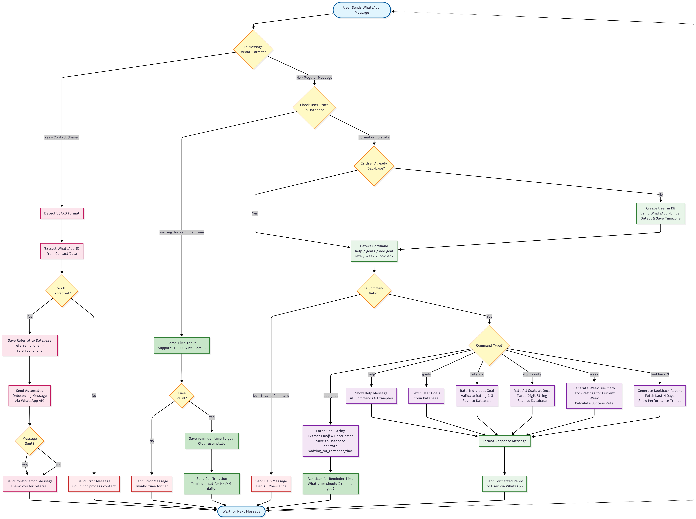

# Life Bot User Journey

> **Scope:** From WhatsApp message to backend response

---

## Diagram



_Tip: Click the image to zoom._ 

---

## High-level Flow

1. **User sends WhatsApp message** → WhatsApp client (`whatsapp-client/index.js`) forwards to backend `/process` endpoint
2. **Flask backend** (`backend/main.py`) checks message type:
   - **VCARD format**: Routes to referral system
   - **Regular text**: Checks conversation state → Routes to `process_message(message, sender)`
3. **Backend returns reply** → WhatsApp client relays to user

---

## Message Processing

### 1. Message Type Detection

- **Check:** VCARD pattern (`BEGIN:VCARD...END:VCARD`) via `contact_detector.py`
- **YES:** → Contact Sharing Flow
- **NO:** → Check conversation state

### 2. Contact Sharing Flow (Referral System)

1. **Extract WAID** from VCARD (`waid=(\d+)`) → `contact_detector.py`
2. **Process Referral** → Convert to local format → Save to `referrals` table (duplicate check) → `referral_tracker.py`
3. **Send Welcome** → Automated onboarding via `whatsapp_sender.py` + `api/whatsapp_api.py`
4. **Confirm** → Success message to referrer

### 3. Conversation State Check

- **Query** `user_states` table via `state_manager.py`
- **If waiting_for_reminder_time:** → Time Input Flow
- **Else:** → Command Processing

### 4. Time Input Flow (Multi-Step Reminder Setup)

1. **Parse Time** → Accepts `18:00`, `6 PM`, `6:30 PM`, `6pm`, `6` via `time_parser.py`
2. **Validate** → Hours 0-23, minutes 0-59 (error with format examples if invalid)
3. **Save** → Update goal's `reminder_time` → Clear state via `add_goal.py`
4. **Confirm** → Goal active with daily reminders

### 5. Command Processing

**Flow:**
- Verify user exists (create if needed with timezone detection)
- Parse command (`logic/process_message.py`)
- Validate format (return usage hint if invalid)
- Execute and return response

**Commands:**

| Command | Module | Action |
|---------|--------|--------|
| `goals` | `format_goals.py` | Display goals with reminder times |
| `add goal` | `add_goal.py` | Create goal → Set state → Prompt for time |
| `rate X Y` | `rate_individual_goal.py` | Rate specific goal |
| `123...` | `handle_goal_ratings.py` | Rate all goals |
| `week` | `format_week_summary.py` | Week summary |
| `lookback N` | `look_back_summary.py` | N days history |

---

## WhatsApp Client Integration

Bridges WhatsApp Web and backend (`whatsapp-client/index.js`). See [WhatsApp Client](whatsapp-client.md) for details.

**Functions:**
- Listen for messages → Forward to `/process` → Relay responses
- Expose `/send-message` API for automated messaging
- Manage session persistence

**Message Format:**
```json
{
  "message": "<text or VCARD data>",
  "from": "<phone number>"
}
```

---

## Example Scenarios

### Adding Goal with Reminder
```
User → "add goal 🏃 Exercise daily"
Bot  → "✅ Goal added: 🏃 Exercise daily"
Bot  → "⏰ What time should I remind you daily? (e.g., 18:00, 6 PM, 6pm)"
User → "6:30 AM"
Bot  → "✅ Reminder set for 6:30 AM daily!"

[Next day at 6:30 AM in user's timezone]
Bot → "⏰ Reminder: 🏃 Exercise daily"
```

### Invalid Time Format
```
User → "bedtime"
Bot  → "❌ Invalid time format. Please use formats like: 18:00, 6 PM, 6pm, or 6"
User → "9 PM"
Bot  → "✅ Reminder set for 9:00 PM daily!"
```

### Rating Goals
```
User → "312"           # Rate all goals
User → "rate 2 3"      # Rate specific goal #2
```

### View Summaries
```
User → "week"          # Current week status
User → "lookback 5"    # Last 5 days history
```

### Referral System
```
User shares contact → Bot extracts WAID → Saves referral (duplicate check)
Bot → Sends automated welcome to referred contact
Bot → "🎉 Thank you for the referral!" to referrer
```

---

## Technical Details

**Data Persistence:**
- SQLite database (`life_bot.db`) stores all data
- `user_states` table tracks conversation context

**Conversation State:**
- States: `waiting_for_reminder_time`, `normal`
- Checked before command processing
- Cleared after completion

**Reminder System:**
- Background daemon calculates next reminder → sleeps until due
- Timezone-aware with deduplication (caches sent per day)
- Starts with Flask app

**Timezone Detection:**
- Uses `phonenumbers` library to extract country code
- Maps to IANA timezone (e.g., Asia/Karachi)
- Saved on first goal creation (fallback to system timezone)

**Time Formats:**
- Accepts: `18:00`, `6 PM`, `6:30 PM`, `6pm`, `6`
- Validates hours (0-23) and minutes (0-59)

**VCARD Format:**
- WhatsApp contact sharing format
- Pattern: `TEL;type=CELL;waid=<number>`